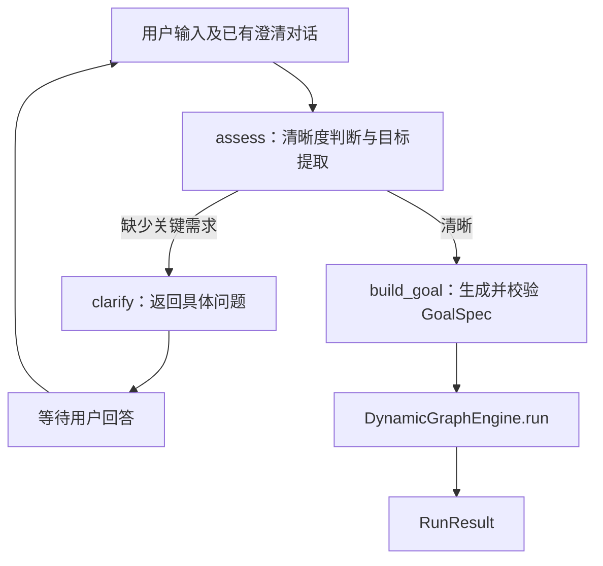

# Karen

Personal Agent 的第一步：将用户请求澄清为可执行目标，并交给 DynamicAgentGraph 执行。
目前只实现显式用户任务，不包含历史记录的主动分析。

## 职责与流程

`IntentRecognizer` 是独立模块，使用 LangGraph 表达每轮状态流。
清晰度判断与目标提取共用一次结构化模型调用；生成 `GoalSpec` 是本地转换与校验，
不需要再次调用模型。Karen 只连接该模块与任务引擎，不实现第二套执行调度。

意图识别模块独立放在 `src/karen/intent/`：

- `recognizer.py`：意图契约、澄清状态图及 GoalSpec 生成。
- `prompts.py`：系统提示词与任务指令，优化提示词时修改该文件即可。
- `__init__.py`：导出 `IntentRecognizer` 和 `IntentSession`。



使用 LangGraph 的理由是条件分支显式、状态与节点职责清晰，同时可以独立测试。
当前每轮图运行到返回问题或生成目标就结束；调用方保存 `IntentSession`，下一次输入时继续。
尚无跨进程恢复需求，因此不额外引入 checkpointer、共享会话仓库或 `interrupt()`。
每个会话在生成目标后终止；新任务使用新会话。调用方可以先独立运行意图模块、审阅目标，
也可以使用 `Karen.advance` 在目标清晰后自动执行。

- 仅澄清会影响目标、范围、交付物或验收的信息；可选偏好不应阻塞任务。
- 多轮澄清保留用户输入与提出的问题；没有强制结束澄清的轮数上限。
- 空输入、无问题的澄清结果、空目标和空成功标准都被拒绝。
- 模型输出失败时抛出异常，输入会话保持原样，调用方决定是否重试。
- `GoalSpec` 直接使用引擎契约；request_id 和成功标准 ID 由本地生成。
- 约束、对话来源与调用方上下文放入 `GoalSpec.context`；数据放入 `inputs`。
- 用户时区写入 `GoalSpec.context["timezone"]`，也传给意图模型。`IntentSession` 默认通过
  `tzlocal` 获取本机 IANA 时区（如 `Asia/Shanghai`），并校验其有效性。
  调用方可通过 `IntentSession(timezone="America/New_York")` 显式指定用户时区；
  在远程服务器运行时应传入用户端提供的时区，不能将服务器时区视为用户时区。
- 输出默认使用引擎的 answer/evidence/limitations 格式，也支持用户明确要求的结构化结果。
- 未显式传入 `ExecutionPolicy` 时，Karen 授权当前引擎中全部已注册工具、评估器和 reducer。
  对标记为 `read_only=False` 的工具，同时填入 `allowed_side_effect_tools`，满足引擎的双重授权规则。
  每次开始执行时读取能力列表，因此新注册的能力也会被纳入。显式策略按调用方给出的白名单执行，
  模型不能增加工具权限。

## 安装和运行

需要 Python 3.11 或 3.12，以及相邻目录中的 DynamicAgentGraph。
`uv` 使用本地源码依赖；仅在 Karen 的环境安装，不修改 DynamicAgentGraph 源码。

```bash
uv sync
export DEEPSEEK_API_KEY='你的密钥'
uv run karen
```

终端默认直接展示 `answer`、来源和限制说明，不再打印整份执行记录。
执行失败、取消或结果不完整时明确提示状态，并展示诊断；自定义输出字段也会显示。
调试时使用 `uv run karen --json` 查看完整结果 JSON。完整执行记录仍由引擎保存在 `runs/`。

CLI 可通过 `uv run karen --timezone Asia/Shanghai` 指定用户时区。
无法检测时区或传入无效时区时会提示并退出，不会继续生成缺少时区的目标。

也可以在根目录 `.env` 中设置 `DEEPSEEK_API_KEY` 和 `TAVILY_API_KEY`，然后运行
`uv run --env-file .env karen`。`.env` 已被 Git 忽略。

模型后端使用 LangChain 的 `ChatDeepSeek`（`langchain-deepseek`），默认 `deepseek-chat`。
它由 DynamicAgentGraph 已有的 `LangChainModelClient` 转换成共同的 `ModelClient` 接口，
供意图模块与引擎使用。以后替换其他 LangChain 模型时，可直接通过
`LangChainModelClient(chat_model=..., model=...)` 注入，无需改动意图图。
提供者自动重试关闭；任务执行阶段的重试由引擎管理。

CLI 默认注册并授权 DynamicAgentGraph 提供的以下工具（版本均为 `1.0.0`）：

| 能力 | 用途 |
| --- | --- |
| `file.read_text` | 读取 `/tmp` 下的 UTF-8 文本 |
| `file.write_text` | 写入 `/tmp` 下的 UTF-8 文本；覆盖已有文件需要 `overwrite=true` |
| `browser.open_local_page` | 请求默认浏览器打开 `/tmp` 下已有的 HTML 页面 |
| `web.fetch` | 获取 HTTP/HTTPS 网页文本；任务中的 LLM 节点按要求提取信息 |
| `tavily.search` | Tavily 网络搜索，需要配置 `TAVILY_API_KEY` |

未配置 Tavily 密钥时仅该搜索工具不可用，其他工具仍会注册与授权。
本地工具沿用库的 `/tmp` 目录边界，文本与网页大小限制沿用默认的 1 MiB。
网页抓取返回当前页面内容，不提供任意历史日期的快照。
3 个内置 reducer 同样默认授权。EOF 或 Ctrl+C 退出。

## 独立调用意图模块

```python
from karen import IntentRecognizer, IntentSession
from karen.models import deepseek_client

recognizer = IntentRecognizer(deepseek_client())
session = IntentSession(user_context={"language": "zh-CN"})
session = await recognizer.advance(session, "帮我写一封邮件")
if session.goal is None:
    print(session.questions)  # 向用户展示，拿到回答后再次调用 advance
else:
    print(session.goal.model_dump(mode="json"))
```

## 完整执行

```python
from dynamic_graph import DynamicGraphEngine, ModelBindings
from karen import IntentRecognizer, IntentSession, Karen
from karen.models import deepseek_client

model = deepseek_client()
engine = DynamicGraphEngine(models=ModelBindings(planner=model, worker=model))
agent = Karen(intent=IntentRecognizer(model), engine=engine)
turn = await agent.advance(
    IntentSession(),
    "用中文解释高内聚与低耦合，分别给出一个 Python 例子。",
)
if turn.result is None:
    print(turn.session.questions)
else:
    print(turn.result.execution_status, turn.result.outputs)
```

`COMPLETED` 和 `output_complete` 只描述执行与输出结构；不意味着所有业务成功标准
已被独立验收。引擎的失败、能力不足、取消及诊断信息通过 `RunResult` 原样返回。
当前引擎没有执行中“等待确认”的状态，该能力不属于本次意图澄清模块。
会话没有持久化，也没有并发去重或网络请求幂等保障；上层应用负责保管会话、
避免并发提交同一轮，并确保只调用一次执行入口。

## 验证

```bash
uv run pytest
uv run ruff check .
```

测试使用可控模型响应，包含多轮澄清及真实 DynamicGraphEngine 的离线执行，
不消耗模型 API 额度。它们验证流程与契约，不衡量模型语义判断的准确率。

官方参考：[LangGraph Graph API](https://docs.langchain.com/oss/python/langgraph/graph-api)、
[ChatDeepSeek](https://docs.langchain.com/oss/python/integrations/chat/deepseek)。
