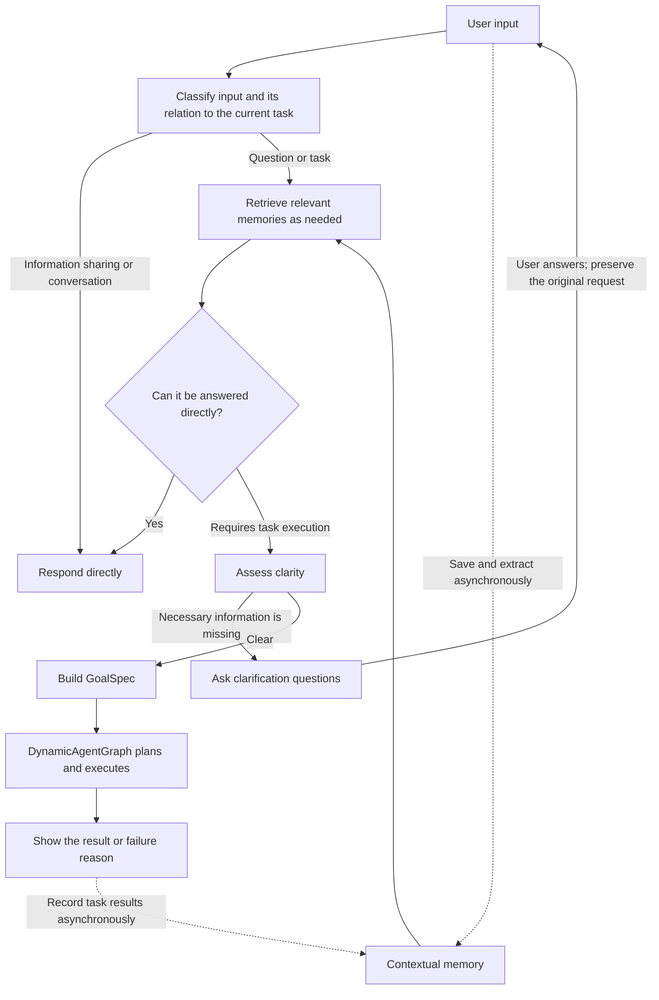

# Karen

English | [简体中文](README_cn.md)

Karen is a personal agent that understands what you want to do, retrieves relevant memories, turns requests into goals with success criteria, and uses tools to carry them out.

Our aim is to build a Personal Agent that understands its user, proactively identifies problems, and moves work forward. **The current version supports user-initiated conversations, contextual memory, task execution, and observability. Proactive task discovery and pausing execution for user confirmation are not yet implemented.**

## Why build Karen?

Using an agent often leaves users responsible for connecting the steps: repeating background information, filling in missing requirements, keeping unrelated tasks separate, and figuring out where a failed request got stuck.

Karen aims to reduce that work and make the path from a request to a result more continuous:

- **Clarify what matters.** Natural language is often incomplete, but not every unspecified preference needs a question. Karen distinguishes necessary information from details that can use reasonable defaults, preserves the original request and clarification answers, and works toward an executable goal.
- **Keep useful context available.** Users should not have to repeat their preferences and experiences in every interaction. Each new request retrieves relevant background; unrelated questions do not automatically inherit the entire recent conversation.
- **Connect goals to execution.** Requests that require research, actions, or files enter a task engine through a shared goal contract, with records of execution, outputs, and failures.
- **Make behavior inspectable and improvable.** Runtime traces help locate problems in routing, clarification, memory, planning, and tool calls. Fixed evaluations check whether general fixes work.

## What can Karen do today?

| Capability | What it supports |
| --- | --- |
| Multi-turn conversation and input routing | Distinguishes information sharing, casual conversation, questions, task requests, and updates or cancellation of a task awaiting clarification |
| Necessary clarification | Asks specific questions when required information is missing, merges the answers, and reassesses until the goal is clear |
| Personal contextual memory | Automatically extracts and verifies long-term facts, preferences, and event summaries; supports retrieval across restarts and changes to facts |
| Research and deliverables | Searches public sources, reads web pages, organizes text, writes text or HTML files under `/tmp`, and requests that the local browser open HTML files |
| Observability | Shows decisions, retrieval candidates, model calls, execution graphs, artifacts, and the causes of failures or degraded operation |

For example, you can tell Karen “I like history and archaeology” and “I enjoy sports, such as cycling,” then later ask “What are my hobbies?” You can also ask it to research a topic, organize the findings, and save them as HTML. Memory writes run in the background, so new information may take time to become retrievable.

The current interaction interface is a CLI. Task completion depends on registered tools, available data, and model decisions. Known semantic and execution issues are described in the evaluation section below.

## How Karen works

Karen uses modules with high cohesion and low coupling. Input understanding, contextual memory, and observability are separate modules within Karen; [DynamicAgentGraph](https://github.com/DavidLiuXh/DynamicAgentGraph) handles task planning and execution.



### From input to an executable goal

The input module uses LangGraph to express response, clarification, and goal-building flows. Sharing personal information does not require task planning. Questions answerable from the current input or relevant memories receive a direct response; requests requiring external information, actions, or deliverables enter the execution path.

Clarification preserves the original request, pending questions, and their associated answers. A partial answer does not discard other pending questions. Each turn reassesses clarity and asks only for information necessary to determine the goal, scope, deliverable, or acceptance criteria. The user's timezone and the initial input time provide the reference for relative dates such as “today” and “tomorrow.”

Once the goal is clear, Karen creates a DynamicAgentGraph `GoalSpec` containing the objective, success criteria, constraints, inputs, and context. The engine plans an execution graph, invokes authorized capabilities, and returns a result. Valid execution status and output structure do not mean that every business success criterion has been independently verified.

### Three memory layers and selective retrieval

| Layer | Contents | Purpose |
| --- | --- | --- |
| m1 | Long-term facts and preferences with sources and model verification | Answers questions about current personal information and supplies persistent background |
| m2 | Summaries of facts, actions, status, and deliverables from conversations and tasks | Provides initial retrieval of past events and locates related tasks and evidence |
| m3 | Detailed JSONL records rotated by the user's local date, plus attachments | Supplies original details through summary references or a clearly bounded search |

Memories retain source roles, times, status, and version relationships. “I plan to move to Shanghai” and “I currently live in Beijing” can coexist. Completed changes, corrections, and unresolved conflicts are handled separately rather than simply overwriting older records by timestamp.

Writing, extraction, verification, and embedding run asynchronously. Retrieval before answering a question or executing a task waits for the final result:

**Vector search + BM25 → RRF fusion → Complete version relationships → Bound reranking input → LLM reranking → Look up m3 details as needed.**

If reranking fails, Karen retains the fused order and explicitly records degraded operation. History from other tasks is selected by relevance; the current session directly preserves its own clarification conversation. Model calls use a common interface with DeepSeek as the default backend. Local Ollama BGE-M3 generates embeddings, while SQLite and FTS5 store records and indexes.

### Inspecting runtime behavior

Start the local read-only dashboard alongside Karen with `--observe` to investigate questions such as “Why did it ask for clarification?”, “Why was this memory retrieved?”, and “Why did the tool fail?” Normal responses present the result the user needs; internal data such as memory IDs, full model requests, and diagnostics remain in the observation records.

## Evaluation results

**As of 2026-10-07, the latest code has not completed a full rerun of the fixed evaluation set.** The table below shows the most recent saved full run, for Karen **`6a0f483`**, before subsequent changes to general prompt rules, reasoning settings, and recovery from truncated output.

| Evaluation set | Main focus | Passed / Total | Pass rate |
| --- | --- | ---: | ---: |
| CLAMBER fixed subset | Whether clarification is needed and whether questions resolve the substantive gap | 14 / 24 | 58.3% |
| LongMemEval oracle fixed subset | Memory across restarts, fact updates, temporal reasoning, and insufficient information | 13 / 14 | 92.9% |
| Karen Chinese regression | Routing, multi-turn clarification, dates, preferences, residence changes, and cancellation | 11 / 12 | 91.7% |
| Independent variant regression | Different wording and conditions to check general fixes | 12 / 12 | 100% |
| Boundary regression | Closed conditions, intended uses, preference relationships, and other boundaries | 4 / 4 | 100% |
| **Total** | **The same fixed set** | **54 / 66** | **81.8%** |

The preceding run of the same set scored 47/66. Eight additional clarification regression cases scored 8/8 in this run and are not included in the denominator above. See the [full evaluation report](docs/EVALUATION_FULL_ACCEPTANCE_20261007.md) for all failures and the comparison basis.

Validation of subsequent changes is reported separately, without combining it with earlier scores:

| Subsequent validation | Result | Notes |
| --- | --- | --- |
| New transfer regression cases after generalizing prompt rules | 10 / 12 | One judgment failure and one model service error; development regression, not a blind evaluation |
| Live integration spot checks after reasoning and truncation-recovery changes | 3 / 3 | Covers hobbies, current residence, and relative dates; truncation recovery was verified with simulated HTTP responses |

These are **results on small fixed samples, not the complete public datasets or official leaderboard scores**. LongMemEval uses oracle evidence histories and a custom DeepSeek grader; S/M histories with long distractor context have not been evaluated. CLAMBER checks responses, clarification, or GoalSpec generation, not successful execution of external tasks. Runtime and grading errors count in the denominator, and successful repeats do not replace earlier failures.

Remaining issues include inconsistent judgments about necessary information versus optional preferences, errors in interpreting some conditions and references, inconsistent goal language for English inputs, and planning, output-budget, and execution-deadline problems in complex tasks. Some public labels and grading decisions are also disputed; the original judgments are retained. Later fixes have local validation, but this does not yet establish an improved pass rate for the full set.

Details: [evaluation protocol and reproduction](docs/EVALUATION.md), [prompt-generalization validation](docs/PROMPT_POLICY_VERIFICATION_20261007.md), and [reasoning and truncation-recovery validation](docs/MODEL_BUDGET_VERIFICATION_20261007.md).

## Installation

### 1. Prepare the environment and source code

You need Git, Python 3.11 or 3.12, [uv](https://docs.astral.sh/uv/getting-started/installation/), [Ollama](https://ollama.com/download), and a DeepSeek API key. Web search also requires a Tavily API key.

Installation currently uses local source code. You need access to both repositories, placed in sibling directories:

```bash
mkdir -p ~/opensource
cd ~/opensource
git clone https://github.com/DavidLiuXh/DynamicAgentGraph.git
git clone https://github.com/DavidLiuXh/Karen.git
cd Karen
uv sync --python 3.12
```

If you already have the source code, run `uv sync` from the Karen directory. `pyproject.toml` points to `../DynamicAgentGraph`; installation does not modify the engine's source code.

### 2. Prepare the local embedding model

Start the Ollama service. Skip this step if it is already running:

```bash
ollama serve
```

Download the model in another terminal. Skip the download if it is already installed:

```bash
ollama pull bge-m3:latest
```

Ollama provides embeddings; the default LLM is still cloud-hosted DeepSeek. If Ollama is temporarily unavailable, existing records can fall back to BM25, and embedding failures are recorded.

### 3. Configure API keys

Create `.env` in the Karen repository root and fill in your keys:

```dotenv
DEEPSEEK_API_KEY=your_deepseek_api_key
TAVILY_API_KEY=your_tavily_api_key
```

`DEEPSEEK_API_KEY` is required. Omit `TAVILY_API_KEY` if you do not need web search. Git ignores `.env`.
Load it explicitly with `uv run --env-file .env ...`, or export the corresponding environment variables in your shell.

## Usage

### Start Karen and inspect its behavior

Run from the Karen directory:

```bash
uv run --env-file .env karen --observe
```

Open the URL printed at startup, which defaults to `http://127.0.0.1:8765/`. The dashboard refreshes every two seconds and shuts down when Karen exits. Use `--observe 8766` if the port is occupied. Omit `--observe` if you do not need the dashboard; runtime records are still saved.

| Option | Purpose |
| --- | --- |
| `--observe [PORT]` | Starts the observation dashboard alongside Karen; default port: 8765 |
| `--timezone Asia/Shanghai` | Explicitly sets the user's IANA timezone; defaults to the local machine's timezone |
| `--json` | Displays the full result JSON for debugging |
| `--wechat` | Uses personal Weixin; offers QR binding on first start |
| `--wechat-login` | Binds or refreshes Weixin credentials without starting the model |
| `--help` | Shows command help |

When running remotely, explicitly provide the user's timezone. Normal output shows the direct response or the execution result's `answer`. Requested sources and material limitations belong in the answer; internal audit fields are not appended automatically.

### Use personal Weixin

```bash
uv run karen --wechat-login
uv run --env-file .env karen --wechat --timezone Asia/Shanghai --observe
```

Scan with your personal Weixin account and confirm on your phone. Karen accepts only
the binding owner's private messages and supports text, persistent clarification,
file attachments and delivery retries. The dashboard includes channel events.
See [personal Weixin setup and recovery](docs/WEIXIN.md) for limits, file delivery,
durability guarantees and the live-account acceptance checklist.

### Enter requests

These examples cover personal information, memory queries, research, and file delivery:

```text
I like history and archaeology, and I also enjoy cycling.
What are my hobbies?
Summarize information from the past month about lure-fishing waters in Beijing. A written summary is enough.
Save the summary you just prepared as /tmp/beijing-lure.html and open it in my local browser.
```

Answer clarification questions directly. Karen merges the current task's requirements and reassesses them; unrelated new requests are handled separately. It waits for another input after each task finishes.

Exit with `/exit`, EOF, or Ctrl+C. Normal shutdown waits for original records and recovery state to be persisted; unfinished background model jobs can resume on the next startup. Forced termination may lose information that has not reached disk. After restarting, Karen can retrieve saved memories, but it does not restore an unfinished clarification or execution session.

### Available tools

The CLI registers and authorizes the capabilities currently available to it. Without Tavily configuration, only the search tool is unavailable.

| Tool | Purpose and boundaries |
| --- | --- |
| `tavily.search` | Searches public web sources; requires `TAVILY_API_KEY` |
| `web.fetch` | Reads current HTTP/HTTPS page text; does not provide snapshots for arbitrary historical dates |
| `file.read_text` / `file.write_text` | Reads or writes UTF-8 text under `/tmp`, with a default 1 MiB size limit; overwriting must be explicitly requested |
| `browser.open_local_page` | Requests that the default browser open an existing HTML file under `/tmp`; a successful launch request does not establish successful rendering |

Custom integrations can pass an `ExecutionPolicy` to restrict the capability allowlist. The model cannot expand its own permissions. Pausing execution to wait for user confirmation is not currently supported.

### Local data and historical records

Memory is shared across projects and sessions. Only one process may write to a given memory directory at a time. The directory name retains the implementation's spelling, **`.Karne`**:

```text
~/.Karne/
  context/          # m1/m2, vector and full-text indexes, m3 originals and attachments
  observability/    # Decisions, model calls, and background processing traces
  runs/             # DynamicAgentGraph execution graphs, node records, and artifacts
  weixin/           # Private channel credentials, durable inbox/outbox, file snapshots
```

Memories and runtime records are stored locally. Model extraction, decisions, reranking, and responses send the required inputs to the configured LLM service; web search calls Tavily. Observation logs are stored separately from user memory.

After Karen exits, you can still view historical records with a standalone command:

```bash
uv run karen-observe --open
```

## Development and further reading

The main entry point is `Karen.advance(session, text)`. Read `TaskTurn.response` for a direct response, `TaskTurn.result` for actual execution, or `session.questions` if neither is present. Pass `turn.session` into the next turn. Integrations can use `IntentRecognizer` independently or inject their own execution engine, memory, and model clients.

| Document | Contents |
| --- | --- |
| [Input routing](docs/INPUT_ROUTING.md) | Input classification, direct responses, session relationships, and cancellation boundaries |
| [Multi-turn clarification](docs/CLARIFICATION_STATE.md) | Pending-question ledger, state transitions, and goal construction |
| [Contextual memory design](docs/CONTEXT_MEMORY_DESIGN.md) / [interfaces and operation](docs/CONTEXT_MEMORY_IMPLEMENTATION.md) | m1/m2/m3, version timelines, asynchronous writes, and synchronous retrieval |
| [Observability](docs/OBSERVABILITY.md) | Tracing, diagnostics, read boundaries, and server lifecycle |
| [Prompt maintenance](docs/PROMPT_POLICY.md) | Organizing general rules and few-shot examples |
| [Model settings and budgets](docs/MODEL_BUDGET_VERIFICATION_20261007.md) | Reasoning effort, stage deadlines, and bounded recovery after truncation |
| [Evaluation protocol](docs/EVALUATION.md) / [full evaluation report](docs/EVALUATION_FULL_ACCEPTANCE_20261007.md) | Fixed inputs, grading criteria, reproduction, and case results |

The default model is `deepseek-flash`. Input understanding, responses, execution nodes, and reranking request low reasoning effort; planning requests medium. Memory extraction, verification, and query understanding use non-thinking mode. See [model configuration](src/karen/models.py) for clients and the [CLI entry point](src/karen/cli.py) for stage composition. Prompts live in each module's `prompts.py`.

Run offline behavior and boundary checks with:

```bash
uv run pytest
uv run ruff check .
```

Offline checks use controlled responses and do not consume model API credits. Live model evaluations run separately under the evaluation protocol, use isolated directories, and do not read the user's global memory. Model services and live retrieval incur costs and can produce varying results. Fixes remain general: they must not introduce special branches for individual evaluation cases or change labels to improve scores.
