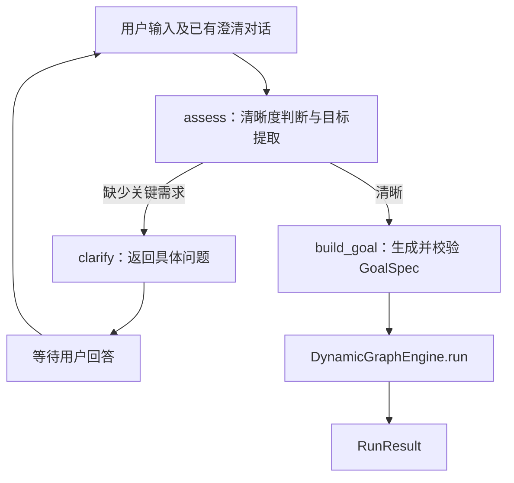

# Karen

Karen 将用户请求澄清为可执行目标，选择相关上下文记忆，再交给 DynamicAgentGraph 执行。
已支持多轮交互与全局上下文记忆；主动发现任务尚未实现。

## 职责与流程

`IntentRecognizer` 是独立模块，使用 LangGraph 表达每轮状态流。
清晰度判断与目标提取共用一次结构化模型调用；生成 `GoalSpec` 是本地转换与校验，
不需要再次调用模型。Karen 只连接该模块与任务引擎，不实现第二套执行调度。

意图识别模块独立放在 `src/karen/intent/`：

- `recognizer.py`：意图契约、澄清状态图及 GoalSpec 生成。
- `prompts.py`：系统提示词与任务指令，优化提示词时修改该文件即可。
- `__init__.py`：导出 `IntentRecognizer` 和 `IntentSession`。



使用 LangGraph 的理由是条件分支显式、状态与节点职责清晰，同时可以独立测试。
当前每轮图运行到返回问题或生成目标就结束；调用方保存 `IntentSession`，下一次输入时继续。
尚无跨进程恢复需求，因此不额外引入 checkpointer、共享会话仓库或 `interrupt()`。
独立意图模块在生成目标后结束该任务的澄清。`Karen.advance` 可连续接收任务：
传入上一任务返回的会话时，自动为新任务创建新的 request_id，并清空此前消息、目标与问题；
保留 conversation_id、调用方提供的用户设置及用户时区。跨任务历史由记忆模块按本轮相关性选择。
调用方可以先独立运行意图模块、审阅目标，也可以使用 `Karen.advance` 在目标清晰后自动执行。
CLI 默认启用独立的 `karen.context` 模块。“继续修改上一份文档”会定位关联任务；
存在多个可能对象或来源不可用时进入澄清。完整独立请求不会携带最近对话。

- 仅澄清会影响目标、范围、交付物或验收的信息；可选偏好不应阻塞任务。
- 多轮澄清保留用户输入与提出的问题；没有强制结束澄清的轮数上限。
- 空输入、无问题的澄清结果、空目标和空成功标准都被拒绝。
- 模型输出失败时抛出异常，输入会话保持原样，调用方决定是否重试。
- `GoalSpec` 直接使用引擎契约；request_id 和成功标准 ID 由本地生成。
- 约束、对话来源与调用方上下文放入 `GoalSpec.context`；数据放入 `inputs`。
- 用户时区写入 `GoalSpec.context["timezone"]`，也传给意图模型。`IntentSession` 默认通过
  `tzlocal` 获取本机 IANA 时区（如 `Asia/Shanghai`），并校验其有效性。
  调用方可通过 `IntentSession(timezone="America/New_York")` 显式指定用户时区；
  在远程服务器运行时应传入用户端提供的时区，不能将服务器时区视为用户时区。
- 首次输入时记录时间基准，以用户时区计算今天、明天等日历日期，供意图模型自动解析，
  并保存到 `GoalSpec.context["time_context"]`。澄清过程中保持基准，新任务重新取时；
  明确指定的日期及任务时区优先，只有真正含糊或矛盾的日期要求才需要澄清。
- 输出默认使用引擎的 answer/evidence/limitations 格式，也支持用户明确要求的结构化结果。
- 未显式传入 `ExecutionPolicy` 时，Karen 授权当前引擎中全部已注册工具、评估器和 reducer。
  对标记为 `read_only=False` 的工具，同时填入 `allowed_side_effect_tools`，满足引擎的双重授权规则。
  每次开始执行时读取能力列表，因此新注册的能力也会被纳入。显式策略按调用方给出的白名单执行，
  模型不能增加工具权限。

## 安装和运行

需要 Python 3.11 或 3.12，以及相邻目录中的 DynamicAgentGraph。
`uv` 使用本地源码依赖；仅在 Karen 的环境安装，不修改 DynamicAgentGraph 源码。

```bash
uv sync
ollama serve  # 已运行时无需再启动
ollama pull bge-m3:latest  # 已安装时无需重复下载
export DEEPSEEK_API_KEY='你的密钥'
uv run karen
```

终端默认直接展示 `answer`、来源和限制说明，不再打印整份执行记录。
执行失败、取消或结果不完整时明确提示状态，并展示诊断；自定义输出字段也会显示。
调试时使用 `uv run karen --json` 查看完整结果 JSON。完整执行记录仍由引擎保存在 `runs/`。
任务完成、失败或取消后都会继续等待下一条输入；输入 `/exit`、EOF 或 Ctrl+C 退出。
正常退出时的退出码对应最后一次任务的执行结果；未执行任务时为 0。
交互输入使用 prompt-toolkit 的异步行编辑，支持中文退格、光标移动后修改；仅提交按回车时的最终文本。
Ctrl+C 会结束行编辑并恢复终端状态，然后等待正常退出所需的持久化完成；退出后可以继续在同一 shell 输入。

CLI 可通过 `uv run karen --timezone Asia/Shanghai` 指定用户时区。
无法检测时区或传入无效时区时会提示并退出，不会继续生成缺少时区的目标。

也可以在根目录 `.env` 中设置 `DEEPSEEK_API_KEY` 和 `TAVILY_API_KEY`，然后运行
`uv run --env-file .env karen`。`.env` 已被 Git 忽略。

模型后端使用 LangChain 的 `ChatDeepSeek`（`langchain-deepseek`），默认 `deepseek-chat`。
它由 DynamicAgentGraph 已有的 `LangChainModelClient` 转换成共同的 `ModelClient` 接口，
供意图模块与引擎使用。以后替换其他 LangChain 模型时，可直接通过
`LangChainModelClient(chat_model=..., model=...)` 注入，无需改动意图图。
提供者自动重试关闭；任务执行阶段的重试由引擎管理，记忆后台任务按持久化状态有限重试。

CLI 默认注册并授权 DynamicAgentGraph 提供的以下工具（版本均为 `1.0.0`）：

| 能力 | 用途 |
| --- | --- |
| `file.read_text` | 读取 `/tmp` 下的 UTF-8 文本 |
| `file.write_text` | 写入 `/tmp` 下的 UTF-8 文本；覆盖已有文件需要 `overwrite=true` |
| `browser.open_local_page` | 请求默认浏览器打开 `/tmp` 下已有的 HTML 页面 |
| `web.fetch` | 获取 HTTP/HTTPS 网页文本；任务中的 LLM 节点按要求提取信息 |
| `tavily.search` | Tavily 网络搜索，需要配置 `TAVILY_API_KEY` |

未配置 Tavily 密钥时仅该搜索工具不可用，其他工具仍会注册与授权。
本地工具沿用库的 `/tmp` 目录边界，文本与网页大小限制沿用默认的 1 MiB。
网页抓取返回当前页面内容，不提供任意历史日期的快照。
3 个内置 reducer 同样默认授权。

## 独立调用意图模块

```python
from karen import IntentRecognizer, IntentSession
from karen.models import deepseek_client

recognizer = IntentRecognizer(deepseek_client())
session = IntentSession(user_context={"language": "zh-CN"})
session = await recognizer.advance(session, "帮我写一封邮件")
if session.goal is None:
    print(session.questions)  # 向用户展示，拿到回答后再次调用 advance
else:
    print(session.goal.model_dump(mode="json"))
```

## 完整执行

```python
from dynamic_graph import DynamicGraphEngine, ModelBindings
from karen import IntentRecognizer, IntentSession, Karen
from karen.models import deepseek_client

model = deepseek_client()
engine = DynamicGraphEngine(models=ModelBindings(planner=model, worker=model))
agent = Karen(intent=IntentRecognizer(model), engine=engine)
turn = await agent.advance(
    IntentSession(),
    "用中文解释高内聚与低耦合，分别给出一个 Python 例子。",
)
if turn.response is not None:
    print(turn.response)
elif turn.result is not None:
    print(turn.result.execution_status, turn.result.outputs)
else:
    print(turn.session.questions)

# 第一项任务已产生结果时，传入返回会话即可开始另一项独立任务。
if turn.session.completed:
    next_turn = await agent.advance(turn.session, "用中文解释 Python 列表推导式，给一个例子。")
```

`COMPLETED` 和 `output_complete` 只描述执行与输出结构；不意味着所有业务成功标准
已被独立验收。引擎的失败、能力不足、取消及诊断信息通过 `RunResult` 原样返回。
当前引擎没有执行中“等待确认”的状态，该能力不属于本次意图澄清模块。
IntentSession 的运行状态没有跨进程恢复；详细对话与公共任务结果由记忆模块保存。
任务执行入口没有并发去重或网络请求幂等保障；上层应用负责保管会话、
避免并发提交同一轮，并确保只调用一次执行入口。

## 上下文记忆

默认目录严格使用 `~/.Karne/context`，跨项目和会话有效。同一目录同时只允许一个写入进程。
模块实现与接口见 [详细设计](docs/CONTEXT_MEMORY_DESIGN.md) 和 [运行与验收说明](docs/CONTEXT_MEMORY_IMPLEMENTATION.md)。

- m1：有直接来源、经 backend 自动核验的长期事实和偏好，保留替代、纠正、冲突及有效时间。
- m2：事件与行动摘要、执行状态和交付物引用，关联明确的 m1 版本。
- m3：按来源用户时区日期轮转的 JSONL 原文，长文本放入同目录附件。

`submit()` 只校验、隔离并入队；原文落盘与 LLM 提取/向量处理有独立后台 worker。
正常退出自动等待原文、附件、登记与恢复检查点持久化；未完成的模型任务在下次启动继续。
`close()` 不要求剩余模型调用全部成功；需要索引追平时显式 `await memory.flush()`。
强制退出可能丢失未落盘队列；写入失败可查询，并在退出时报告。

提取、核验、查询理解和精排注入通用 `ModelClient`，默认 DeepSeek；向量使用 LangChain
`Embeddings` 接口，默认本机 BGE-M3。SQLite 保存事实与修订、float32 向量，FTS5 + jieba 提供 BM25。
召回在本轮等待完成：粗检索 → RRF 融合 → 补齐版本 → 限制候选 → LLM 精排 → 必要原文查找。
精排失败沿用融合顺序，标记 `degraded/unverified`；缺向量可用 BM25，存储不可用与无相关记忆明确区分。
召回最终结果放入 `GoalSpec.context["memory"]`，当前明确要求优先于旧偏好，记忆不扩大工具授权。
“我有哪些爱好”等个人事实查询使用 `facts` 类型，默认读取当前有效 m1，无需任务历史时间范围。
当前事实粗召回有 m1 时优先精排 m1 及其版本/冲突关系，避免无关 m2 摘要挤占预算；
没有 m1 候选时保留 m2 作为证据线索，不能据此虚构已核验事实。
新增不同爱好可并存，明确撤回或纠正才更新对应偏好。

日常回答直接呈现 `answer`，不自动追加标准 `evidence/limitations` 审计字段；
用户要求的来源及影响结论的重要限制由模型写入回答。完整输出保留在 `--json`、运行记录与
可观测页面中。统一回答指令位于 `src/karen/prompts.py`，并传入 `GoalSpec.context.response_instruction`。

独立使用：

```python
from pathlib import Path
from karen.context import ContextMemory, ContextEvent, RecallQuery
from karen.models import deepseek_client, memory_embeddings

memory = ContextMemory(
    root_dir=Path.home() / ".Karne" / "context",
    model=deepseek_client(),
    embeddings=memory_embeddings(),
)
await memory.start()
try:
    receipt = memory.submit(ContextEvent(
        conversation_id="conversation-1", request_id="task-1",
        event_type="user_message", timezone="Asia/Shanghai",
        payload={"content": "我的长期回复语言偏好是中文。"},
    ))
    await memory.flush(receipt)  # 仅演示 read-after-write；日常交互不等待后台提取
    recalled = await memory.recall(RecallQuery(
        text="我偏好哪种回复语言？", timezone="Asia/Shanghai",
        conversation_id="conversation-1", request_id="task-2",
    ))
    print(recalled.context())
finally:
    await memory.close()
```

API 调用方将实例通过 `Karen(..., memory=memory)` 注入；未注入时保持原有独立任务行为。
完整交互在 `foreground()` 内暂停发起新后台模型调用；已发出的请求可能仍在进行。
任务结果由 Karen 自动记录，UI 展示后调用 `agent.record_response(turn.session, displayed_text)`
保存实际回复；CLI 已接入这一流程。调用方负责 `start()`/`close()` 生命周期。

记忆属于最终一致数据：新内容可能尚未进入 m1/m2，结果中的 `coverage.index` 显示积压与失败。
模型关联和提取质量需要持续用实际样本校准；自动测试验证契约，不能保证所有自然语言判断正确。

## 运行观测

CLI 默认记录意图判断、记忆筛选、模型调用和后台写入过程。启动本地只读页面：

```bash
uv sync
uv run karen-observe --open
```

默认地址 `http://127.0.0.1:8765/`，每两秒刷新。可以查看多轮任务时间线、实际
GoalSpec 上下文、执行图、节点产物、失败与降级，以及可自动核对的流程规则。
引擎执行完成与业务验收分别显示；记录不足会标明缺口。

观测保存在 `~/.Karne/observability`，新的引擎记录保存在 `~/.Karne/runs`。
观测文件不进入用户记忆。接口、脱敏及读取边界见 [运行观测说明](docs/OBSERVABILITY.md)。

## 验证

```bash
uv run pytest
uv run ruff check .
```

测试使用可控模型响应，包含多轮澄清及真实 DynamicGraphEngine 的离线执行，
不消耗模型 API 额度。它们验证流程与契约，不衡量模型语义判断的准确率。

官方参考：[LangGraph Graph API](https://docs.langchain.com/oss/python/langgraph/graph-api)、
[ChatDeepSeek](https://docs.langchain.com/oss/python/integrations/chat/deepseek)。


## 输入分类与路由

Karen 先判断输入类型及处理方式，再决定是否使用执行器。信息告知、普通交流和能根据相关记忆
回答的问题直接回应；需要外部信息、操作或交付物的请求继续澄清并生成 GoalSpec。
补充/纠正待澄清任务保留其上下文，无关输入开始新请求；明确取消待澄清任务不会启动执行。
混合输入中的个人事实与任务要求都保留，记忆写入仍独立异步处理。

调用方通过 `TaskTurn.response` 获取直接回复，通过 `result` 获取真实执行结果，均无时读取
`session.questions`。路由理由和完整过程可在观测页面查看。提示词、接口、取消范围及可重复的
合成语义检查见 [输入路由说明](docs/INPUT_ROUTING.md)。
