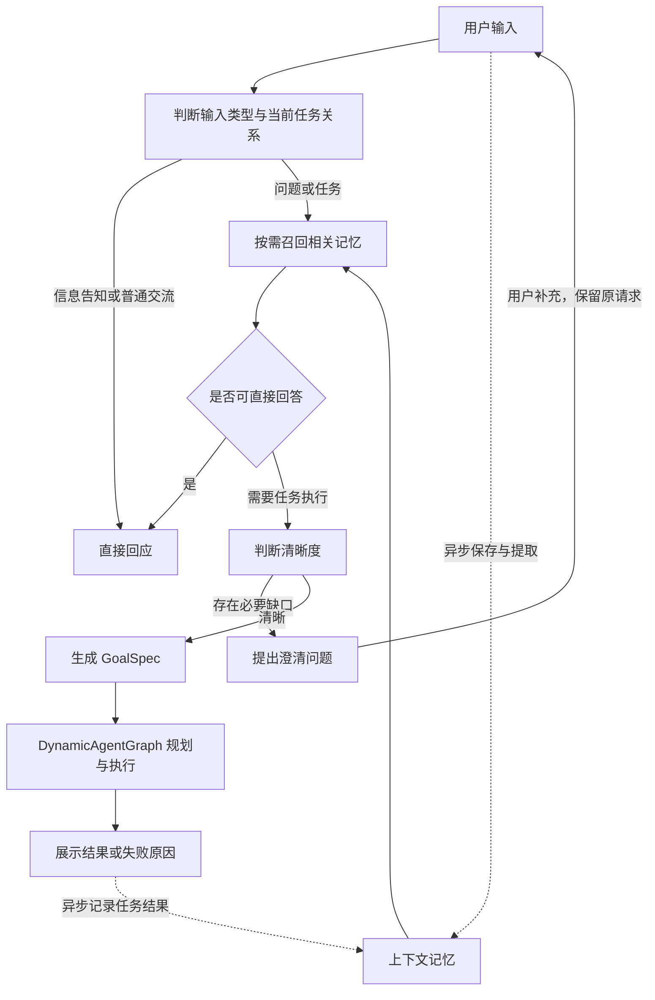

# Karen

[English](README.md) | 简体中文

Karen 是一个面向个人的 Agent：理解用户想做什么，选取相关记忆，把请求转成有成功标准的目标，再调用工具完成任务。

我们希望它逐步成为了解用户、能够主动发现问题并推进工作的 Personal Agent。**当前版本已实现用户发起的多轮对话、上下文记忆、任务执行和运行观测；主动发现任务与执行中等待用户确认尚未实现。**

## 为什么构建 Karen

日常使用 Agent 时，完成一次请求往往还需要用户承担许多衔接工作：反复描述背景、补充遗漏条件、提醒它不要混淆旧任务，并在失败后判断卡在哪一步。

Karen 希望减少这些负担，让请求从“说出来”到“得到结果”的过程连贯起来：

- **把需求说清楚。** 自然语言通常不完整，但不是每个未说明的偏好都需要追问。Karen 区分必要缺口与可采用合理默认值的信息，保留原始请求和澄清回答，逐轮形成可执行目标。
- **让有用背景持续生效。** 用户不必在每次交互中重新介绍自己的偏好和经历；新请求只召回相关背景，独立问题不自动附带最近的整段对话。
- **把目标交给执行流程。** 需要查询、操作或生成文件时，通过统一的目标契约进入任务引擎，记录实际执行、产物和失败原因。
- **让行为可以检查和改进。** 通过运行观测定位路由、澄清、记忆、规划与工具调用的问题，再用固定评测验证通用修复。

## 当前能做什么

| 能力 | 使用方式 |
| --- | --- |
| 多轮对话与输入路由 | 区分信息告知、普通交流、问题、任务请求及待澄清任务的补充或取消 |
| 必要澄清 | 信息不足时提出具体问题；合并回答后重新判断，直到目标明确 |
| 个人上下文记忆 | 自动提取和核验长期事实、偏好、事件摘要，支持跨重启召回及事实变更 |
| 查询与交付 | 搜索公开资料、读取网页、整理文字、生成 `/tmp` 下的文本或 HTML 文件，并请求本机浏览器打开 HTML |
| 运行观测 | 查看每轮决策、召回候选、模型调用、执行图、产物及失败或降级原因 |

例如，可以分别告诉 Karen“我喜欢历史和考古”“我喜欢运动，比如骑行”，之后询问“我有哪些爱好？”；也可以让它检索资料、整理说明并保存为 HTML。记忆写入在后台进行，新信息进入可召回状态可能有延迟。

目前的交互入口是命令行。任务能否完成取决于已注册工具、可获得的数据和模型判断；已知的语义与执行问题见下方评测说明。

## Karen 如何工作

Karen 采用高内聚、低耦合的模块划分：输入理解、上下文记忆和运行观测在 Karen 内独立组织；任务规划与执行由 [DynamicAgentGraph](https://github.com/DavidLiuXh/DynamicAgentGraph) 负责。



### 从输入到可执行目标

输入模块使用 LangGraph 表达回应、澄清与目标构建流程。告知个人信息不需要启动任务规划；能依据本轮输入或相关记忆回答的问题直接回应；需要外部信息、操作或交付物的请求进入任务执行分支。

澄清维护原始请求、待决问题及回答关联，部分回答不会丢掉其余问题。每轮重新判断清晰度，只追问影响目标、范围、交付物或验收的必要信息。用户时区和首次输入时间作为日期基准，“今天”“明天”等相对日期据此解析。

目标明确后生成 DynamicAgentGraph 的 `GoalSpec`，包含目标、成功标准、约束、输入和上下文。引擎据此规划执行图、调用已授权能力，并返回执行结果。执行状态和输出结构通过校验，不等于所有业务成功标准已被独立验证。

### 三层记忆与选择性召回

| 层级 | 内容 | 作用 |
| --- | --- | --- |
| m1 | 有来源并经模型核验的长期事实与偏好 | 回答当前个人信息、提供持续有效的背景 |
| m2 | 对话和任务的事实、行动、状态及交付物摘要 | 初步检索历史事件，定位相关任务与证据 |
| m3 | 按用户当地日期轮转的 JSONL 详细记录及附件 | 根据摘要来源或明确范围补查原文细节 |

记忆保留来源角色、时间、状态及版本关系。“计划搬到上海”与“目前住在北京”可以同时存在；已经发生的变更、纠正和未解决的冲突分别处理，避免只按记录时间简单覆盖。

写入、提取、核验和向量化异步进行；回答问题或执行任务前的召回则等待最终结果：

**向量检索 + BM25 → RRF 融合 → 补齐版本关系 → 限制精排输入 → LLM 精排 → 按需补查 m3。**

精排失败时沿用融合顺序，并明确记录降级。跨任务历史按关联性选择；同一次澄清的对话由当前会话直接保留。模型调用遵循通用接口，默认使用 DeepSeek；向量默认由本机 Ollama 的 BGE-M3 生成，SQLite 和 FTS5 保存索引与记录。

### 查看运行过程

用 `--observe` 随 Karen 一起启动本地只读页面，可以检查“为什么追问”“为什么召回这条记忆”“工具为什么失败”。普通回复呈现用户需要的结果；记忆 ID、完整模型请求和诊断等内部数据保留在观测记录中。

## 评测表现

**截至 2026-10-07，最新代码尚未完成固定清单的完整复测。** 下表是最近一次完整复测的已保存结果，对应 Karen **`6a0f483`**，早于后续通用提示词整理、思考配置和截断恢复改动。

| 评测集 | 主要检查内容 | 通过 / 总数 | 通过率 |
| --- | --- | ---: | ---: |
| CLAMBER 固定子集 | 是否需要澄清、澄清问题是否解决实质缺口 | 14 / 24 | 58.3% |
| LongMemEval oracle 固定子集 | 跨重启记忆、事实更新、时间推理与信息不足 | 13 / 14 | 92.9% |
| Karen 中文回归 | 路由、多轮澄清、日期、偏好、住所变更及取消 | 11 / 12 | 91.7% |
| 独立变体回归 | 用不同表述与条件检查通用修复 | 12 / 12 | 100% |
| 边界回归 | 封闭条件、用途和偏好关系等边界 | 4 / 4 | 100% |
| **合计** | **同一固定清单** | **54 / 66** | **81.8%** |

同一清单上一轮为 47/66；另行新增的八条澄清回归本轮为 8/8，不并入上述分母。完整失败清单和比较依据见 [完整复测报告](docs/EVALUATION_FULL_ACCEPTANCE_20261007.md)。

后续改动的验证单独记录，不与旧成绩拼接：

| 后续验证 | 结果 | 说明 |
| --- | --- | --- |
| 通用提示词整理后的新增迁移回归 | 10 / 12 | 另有 1 条判定失败、1 条模型服务错误；属于开发回归，非盲测 |
| 思考配置与截断恢复后的真实集成抽查 | 3 / 3 | 覆盖爱好、当前住所和相对日期；截断恢复由模拟 HTTP 响应验证 |

这些是**固定小样本结果，不是公开数据集全集或官方榜单成绩**。LongMemEval 使用 oracle 证据历史和自定义 DeepSeek 评分，没有完成 S/M 长干扰历史评测；CLAMBER 测试到回应、澄清或 GoalSpec，不代表外部任务已执行成功。运行错误和评分错误均计入分母，已见用例的重复成功不覆盖此前失败。

当前仍需改进的主要问题包括：必要信息与可选偏好的区分不够稳定，部分条件和指代存在误判，英文目标语言不一致，以及复杂任务的规划、输出预算和执行时限问题。部分公开标签与评分也存在分歧，原判定继续保留。后续修复已有局部验证，但尚不能据此声称整组达标率提高。

详细依据：[评测协议与复现](docs/EVALUATION.md)、[提示词整理验证](docs/PROMPT_POLICY_VERIFICATION_20261007.md)、[配置与截断恢复验证](docs/MODEL_BUDGET_VERIFICATION_20261007.md)。

## 安装

### 1. 准备环境与源码

需要 Git、Python 3.11 或 3.12、[uv](https://docs.astral.sh/uv/getting-started/installation/)、[Ollama](https://ollama.com/download)，以及 DeepSeek API 密钥。网络搜索另需 Tavily API 密钥。

当前采用本地源码安装，需有两个仓库的访问权限，并将它们放在相邻目录中：

```bash
mkdir -p ~/opensource
cd ~/opensource
git clone https://github.com/DavidLiuXh/DynamicAgentGraph.git
git clone https://github.com/DavidLiuXh/Karen.git
cd Karen
uv sync --python 3.12
```

已有源码时直接进入 Karen 目录运行 `uv sync`。`pyproject.toml` 将执行库指向 `../DynamicAgentGraph`；安装不修改执行库源码。

### 2. 准备本地向量模型

启动 Ollama 服务；已经运行时跳过此步骤：

```bash
ollama serve
```

在另一个终端下载模型，已安装时无需重复下载：

```bash
ollama pull bge-m3:latest
```

Ollama 用于 embedding，默认 LLM 仍为云端 DeepSeek。Ollama 暂不可用时，已有记录可降级使用 BM25；向量处理失败会被记录。

### 3. 配置密钥

在 Karen 根目录创建 `.env`，填入自己的密钥：

```dotenv
DEEPSEEK_API_KEY=your_deepseek_api_key
TAVILY_API_KEY=your_tavily_api_key
```

`DEEPSEEK_API_KEY` 必需；不使用网络搜索时可省略 `TAVILY_API_KEY`。`.env` 已被 Git 忽略。
启动时使用 `uv run --env-file .env ...` 显式加载，也可以在 shell 中导出对应环境变量。

## 使用

### 启动并查看运行过程

在 Karen 目录运行：

```bash
uv run --env-file .env karen --observe
```

浏览器访问启动时打印的地址，默认是 `http://127.0.0.1:8765/`。页面每两秒刷新，服务随 Karen 退出关闭。端口被占用时可用 `--observe 8766`；不需要页面时省略 `--observe`，运行记录仍会保存。

| 参数 | 用途 |
| --- | --- |
| `--observe [PORT]` | 同时启动观测页面，默认端口 8765 |
| `--timezone Asia/Shanghai` | 显式指定用户的 IANA 时区；默认读取本机时区 |
| `--json` | 展示完整结果 JSON，便于调试 |
| `--wechat` | 使用个人微信交互，首次启动扫码绑定 |
| `--wechat-login` | 仅绑定或刷新微信凭据，不启动模型 |
| `--help` | 查看命令说明 |

远程运行时应显式提供用户时区。日常显示直接回复或执行结果的 `answer`；用户要求的来源和影响结论的重要限制写入回答，不自动附加内部审计字段。

### 通过个人微信使用

```bash
uv run karen --wechat-login
uv run --env-file .env karen --wechat --timezone Asia/Shanghai --observe
```

用本人的微信扫描二维码并在手机上确认。Karen 只接受绑定者的私聊，支持文字交互、
跨重启继续澄清、文件收发及投递重试。观测页面包含微信渠道事件。
限制、恢复规则和真实账号验收步骤见[个人微信接入说明](docs/WEIXIN_cn.md)。

### 输入请求

下面是可以尝试的输入，分别覆盖个人信息、记忆查询、资料整理和文件交付：

```text
我喜欢历史和考古，也喜欢骑行。
我有哪些爱好？
帮我整理最近一个月北京的路亚水域信息，文字说明即可。
把刚才整理的内容保存为 /tmp/beijing-lure.html，并用本机浏览器打开。
```

需要澄清时直接回答问题，Karen 会合并当前任务要求并重新判断；与旧任务无关的新请求独立处理。每项任务结束后继续等待下一条输入。

输入 `/exit`、EOF 或 Ctrl+C 退出。正常退出等待原文和恢复状态持久化，未完成的后台模型任务留待下次恢复；强制终止可能丢失尚未落盘的信息。重新启动后可以召回已保存的记忆，但不会恢复此前尚未完成的澄清或执行会话。

### 当前工具范围

CLI 默认注册并授权当前可用能力；Tavily 未配置时仅搜索工具不可用。

| 工具 | 用途与边界 |
| --- | --- |
| `tavily.search` | 搜索公开网络资料，需要 `TAVILY_API_KEY` |
| `web.fetch` | 读取当前 HTTP/HTTPS 网页文本，不提供任意历史日期快照 |
| `file.read_text` / `file.write_text` | 读写 `/tmp` 下的 UTF-8 文本，默认大小限制 1 MiB；覆盖须显式指定 |
| `browser.open_local_page` | 请求默认浏览器打开 `/tmp` 下已有的 HTML；打开请求成功不等于渲染成功 |

自定义接入可传入 `ExecutionPolicy` 限定能力白名单，模型不能自行扩大权限。当前没有执行中暂停并等待用户确认的流程。

### 本地数据与历史查看

记忆全局有效，同一记忆目录同时只允许一个写入进程。目录名沿用当前实现的 **`.Karne`**：

```text
~/.Karne/
  context/          # m1/m2、向量和全文索引、m3 原文及附件
  observability/    # 决策、模型调用和后台处理追踪
  runs/             # DynamicAgentGraph 执行图、节点记录和产物
  weixin/           # 私有凭据、持久化收件箱/发件箱、文件快照
```

记忆与运行记录保存在本地；模型提取、判断、精排和回答会将所需输入发送到配置的 LLM 服务，网络搜索调用 Tavily。观测日志与用户记忆分开保存。

Karen 退出后，仍可单独运行以下命令查看历史记录：

```bash
uv run karen-observe --open
```

## 开发与进一步阅读

核心入口是 `Karen.advance(session, text)`：直接回应读取 `TaskTurn.response`，真实执行读取 `TaskTurn.result`，两者都没有时读取 `session.questions`；下一轮传回 `turn.session`。调用方可以独立使用 `IntentRecognizer`，或注入自己的执行引擎、记忆与模型客户端。

| 文档 | 内容 |
| --- | --- |
| [输入路由](docs/INPUT_ROUTING.md) | 输入分类、直接回应、会话关联及取消边界 |
| [多轮澄清](docs/CLARIFICATION_STATE.md) | 待决问题台账、状态转换与目标构建 |
| [上下文记忆设计](docs/CONTEXT_MEMORY_DESIGN.md) / [接口与运行](docs/CONTEXT_MEMORY_IMPLEMENTATION.md) | m1/m2/m3、版本时间线、异步写入与同步召回 |
| [运行观测](docs/OBSERVABILITY.md) | 追踪、诊断、读取范围与服务生命周期 |
| [提示词维护](docs/PROMPT_POLICY.md) | 通用规则与 few-shot 的组织原则 |
| [模型配置与预算](docs/MODEL_BUDGET_VERIFICATION_20261007.md) | 思考强度、阶段时限及截断后的有界恢复 |
| [评测协议](docs/EVALUATION.md) / [完整评测报告](docs/EVALUATION_FULL_ACCEPTANCE_20261007.md) | 固定输入、判定标准、复现与逐例结果 |

当前默认模型为 `deepseek-flash`：输入理解、回应、执行节点和精排请求 low 思考，规划请求 medium；记忆提取、核验和查询理解使用非思考。具体客户端见 [模型装配](src/karen/models.py)，阶段组合见 [CLI 入口](src/karen/cli.py)；提示词集中在各模块的 `prompts.py`。

离线行为与边界检查：

```bash
uv run pytest
uv run ruff check .
```

离线检查使用可控响应，不消耗模型 API 额度。真实模型评测单独按评测协议运行，使用隔离目录，不读取用户全局记忆；模型服务和实时检索会产生费用及结果波动。修复保持通用，不为单个评测题增加专用分支或修改标签来提高分数。
