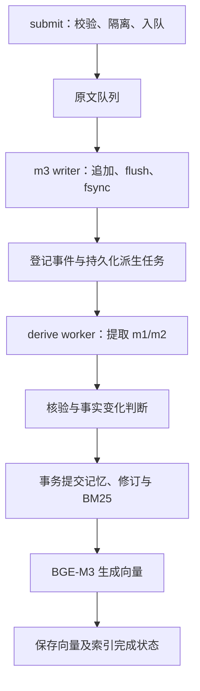
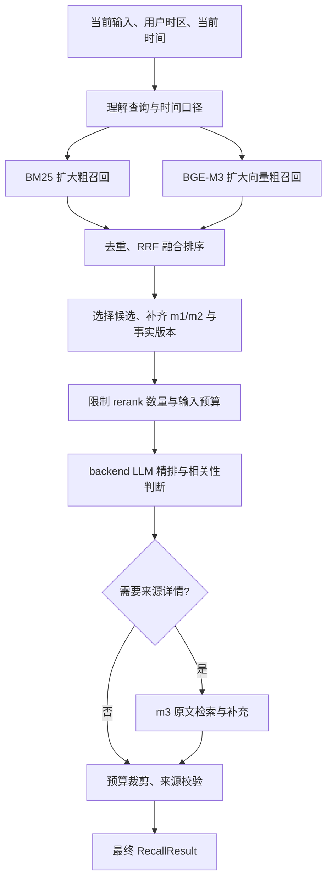

# Karen 上下文记忆体模块详细设计

版本：1.0 · 日期：2026-10-03 · 状态：按最终设计实现，已接入 Karen 与 CLI

本文规定第一版模块边界、公共接口、数据契约、写入和召回流程，以及时间线处理规则。
用户已授权按最终详细设计完整实现。下文的建议参数作为首版实现值，后续根据实际评测调整。
实现与验收证据见 [运行与验收说明](CONTEXT_MEMORY_IMPLEMENTATION.md)。全局目录在运行 start() 时创建，DynamicAgentGraph 源码未改动。

## 1. 已确认需求与审阅入口

### 1.1 已确认

- 上下文记忆为独立模块，以高内聚、低耦合的方式与 Karen 集成。
- m1 保存经过 LLM 自动提取和核验的长期用户知识，不要求用户逐条确认，不打断交互。
- m2 保存对话、任务中的事实、行动、状态和结果摘要，用于初步召回。
- m3 保存详细对话和任务记录，本地 JSON 格式，可以按日期轮转。
- 三层记忆全局有效，目录严格采用用户给出的拼写：`~/.Karne/context`。
- m1、m2 存储向量和元信息，通过向量与 BM25 混合召回，再使用 rerank 精排。
- 回答或执行前等待最终召回结果；需要细节时可由 m2 的来源引用进一步检索 m3。
- m1、m2、m3 的写入在后台异步进行，不等待磁盘、模型或索引处理后才继续用户交互。
- 记忆需表达事实的时间变化、旧事实纠正及未决冲突，并保留来源。
- 记忆模型通过通用接口注入，DeepSeek 作为当前默认实现；切换 backend 不改变提取、核验或召回业务流程。
- 强制退出或断电可以丢失尚未持久化的信息；正常退出自动等待持久化，不要求用户再次确认。
- 粗召回优先扩大候选覆盖；进入 rerank 前限制候选数量与输入预算。融合排序先于 rerank。
- 精排失败时沿用此前已经得到的融合顺序，并明确标记降级。

### 1.2 本轮修订

- 复用已有通用 ModelClient，将 DeepSeek 实例创建放在应用装配边界，明确可替换的模型契约。
- D1 已确认；细化正常退出需要完成的落盘范围和未完成派生任务的恢复行为。
- 区分粗召回规模、融合后的 rerank 输入限制和最终上下文规模。
- 补充 m1 的有时效事实、m2 的变化事件，以及两层按查询需要联动的规则。
- 精排失败的融合降级策略已确认；其他召回故障策略仍单独标为建议。
- 补充 SQLite 的长期容量、向量扫描成本、恢复开销与规模验收边界。
- 补充 16.3 的实际效果风险与评测缺口；其中处理建议尚未确认，不自动改变此前契约。
- 16.4 给出各缺口的首版处理方案；相关接口与流程同步修订为提案，未经本轮确认不视为既定契约。
- 跨轮关联先分析当前输入，按需读取定位线索，确认关联后才向意图/执行模块提供相关历史；m3 补查明确为范围定位与 JSON 字段搜索。

### 1.3 决策状态与审阅入口

| 编号 | 决策 | 影响 |
| --- | --- | --- |
| D1（已确认） | `submit()` 返回表示已进入内存队列；强制退出可丢失未持久化信息；正常退出自动等待持久化 | 无二次确认；正常关闭的落盘范围与恢复保证见 9.3，不为快速退出静默丢弃原文 |
| D2（已落实） | 已确认精排失败时沿用此前融合顺序并标记降级；缺向量时使用 BM25、存储不可读时返回不可用状态等其他处理采用下述降级矩阵 | 精排失败不伪装为成功；仍保留候选中的事实版本、冲突与来源，不把融合位置解释成精排分数 |
| D3 | SQLite 保存 m1/m2、元信息和向量，FTS5 提供 BM25；第一版向量检索采用精确余弦扫描 | 不新增独立向量数据库服务；大规模数据的时延需实测，暂不实现 ANN 或数据库切换框架 |
| D4 | m3 使用按用户当地日期轮转的 JSONL 文件 | 每条记录是完整 JSON，便于追加和崩溃恢复；不是整日一个不断重写的 JSON 数组 |
| D5 | 同一全局目录第一版只允许一个记忆写入进程，启动时持有目录锁 | 支持跨会话共享，但不承诺同时启动多个 Karen 进程共同写入 |
| D6 | 新提交事件最终一致，召回默认不等待写入队列；明确需要立即可召回时调用 `flush()` | 用户刚说过的事实可能尚未进入 m1/m2；当前任务的澄清消息仍由当前会话保管 |

D1–D6 及 16.4 的处理方案已按最终设计实现。候选数量与预算是首版默认值，持续评测其效果。

## 2. 模块边界

模块名为 `karen.context`，对外入口为 `ContextMemory`。

负责：事件接收、m3 落盘、m1/m2 提取与核验、事实版本管理、索引维护、混合召回、精排和原文检索。

Karen 负责：获取用户时区、构造事件、在意图判断前调用召回、将结果显式传给意图模块、提交助手回复及任务结果，并在退出时关闭记忆服务。

意图模块负责：结合当前输入、当前任务澄清消息和本轮召回证据形成目标。记忆是证据数据，不是执行指令，也不增加工具权限。

DynamicAgentGraph 继续负责任务规划和执行，仅通过已有 `GoalSpec.context` 接收上下文。不修改其代码，也不让它调度记忆写入。

第一版不实现自动主动任务、跨用户权限、云同步、自动下载模型或独立记忆服务进程。不自动导入全部历史 `runs/`；历史导入若需要，另行明确范围。
删除、保留期限和安全擦除尚无已确认需求，本设计不提前增加相应 API 或存储机制。

## 3. 对外接口

以下签名为已实现的公共契约；完整数据类型定义在 `src/karen/context/contracts.py`。

```python
class ContextMemory:
    def __init__(
        self,
        *,
        root_dir: Path,
        model: ModelClient,
        embeddings: Embeddings,
    ): ...

    async def start(self) -> None: ...

    def submit(self, event: ContextEvent) -> WriteReceipt: ...

    def foreground(self) -> AsyncContextManager[None]: ...

    async def recall(self, query: RecallQuery) -> RecallResult: ...

    async def search_details(
        self,
        query: DetailQuery,
    ) -> DetailSearchResult: ...

    async def write_status(self, receipt: WriteReceipt) -> WriteStatus: ...

    async def flush(self, receipt: WriteReceipt | None = None) -> None: ...

    async def reindex(self) -> None: ...

    async def close(self) -> None: ...
```

`root_dir` 在应用装配处默认为 `Path.home() / ".Karne" / "context"`，测试可传临时目录。
`ModelClient` 复用 DynamicAgentGraph 已有的单次模型接口；`Embeddings` 使用 LangChain 现有接口。
提取、核验和查询理解使用注入的通用模型客户端；精排可通过 `rerank_model` 单独注入，省略时共用 `model`。
当前应用装配为 DeepSeek：前三者非思考，精排思考 low。

### 3.1 通用 backend LLM 契约

复用已有协议，不另外新增一套内容相同的 MemoryLLM 接口：

```python
class ModelClient(Protocol):
    async def generate(self, request: ModelRequest) -> ModelResponse: ...
```

`ModelRequest` 传入模型角色、系统指令、任务指令、JSON 输入、输出 Schema、输出 token 上限与调用期限。
`ModelResponse` 返回结构化 payload、usage、提供商请求 ID 和响应元信息；业务节点按自己的 Schema 验证 payload。
超时、认证、配额和无效响应使用已有 ModelCallError；请求取消原样传播。

记忆模块只调用此协议，不导入 ChatDeepSeek、不读取 DEEPSEEK_API_KEY、不根据模型名称分支。
应用装配层使用现有 `karen.models.deepseek_client()` 创建默认实现并注入 ContextMemory。
切换其他 backend 时，在装配层注入遵守此协议的客户端；LangChain 模型可复用已有 LangChainModelClient 适配器。
提供商的结构化输出方式、凭据和模型参数由该适配器管理；不要求不同提供商支持完全相同的原生 API。
第一版不提前实现未使用的提供商，也不引入注册中心或多层工厂。
记忆元信息记录实际处理模型，而不是固定填写 DeepSeek；相同证据被不同模型提取时不改变 source_role。

### 3.2 方法行为

| 方法 | 成功含义与等待范围 |
| --- | --- |
| `start` | 获取目录锁，打开存储，完成恢复检查并启动后台服务。启动失败抛出明确错误 |
| `submit` | 完成必要校验及数据隔离，将事件加入队列，立即返回 receipt；不进行磁盘、网络或向量计算 |
| `foreground` | 提案：标记当前用户输入的前台处理区间；暂停发起新的后台模型/向量调用，不暂停 m3 落盘，退出区间自动恢复 |
| `recall` | 在当前请求中等待查询理解、检索、融合、精排和必要的详情读取完成；返回最终上下文，不返回待完成的后台任务 |
| `search_details` | 提案：按来源读取，或按明确的任务/会话/时间范围补查原文，等待最终片段与覆盖说明；不默认遍历全部历史目录 |
| `write_status` | 异步查询事件的持久化、派生记忆和索引状态 |
| `flush` | 捕获调用时的提交序号，等待截至该序号的工作达到终态；传 receipt 时只等待该事件。不被随后不断提交的新事件无限延长 |
| `close` | 停止接收事件，自动等待已接收事件与恢复信息持久化，再释放锁；不询问用户，不因时间上限跳过仍未落盘的原文 |

“同步召回”指业务上的等待关系。Python 使用 `async/await`，IO 与 CPU 工作不阻塞整个事件循环。
禁止在运行中的事件循环里用 `asyncio.run()` 包装一个同步召回 API。

重复提交同一 `event_id` 且内容一致返回同一逻辑 receipt；同 ID 不同内容报错，不能静默覆盖。
队列满时抛出 `MemoryQueueFull`，不阻塞等待空位、不静默丢弃。Karen 可继续执行当前任务并记录记忆提交失败。
启动时加载已持久化事件的 ID 与摘要，提交边界结合内存中的在途事件检查幂等性，不为每次 submit 查询磁盘。

## 4. 对外数据契约

### 4.1 ContextEvent 与 WriteReceipt

| 字段 | 说明 |
| --- | --- |
| `schema_version` | 首版为 `1`，仅用于识别数据格式；未知版本明确拒绝，不预写兼容框架 |
| `event_id` | 全局唯一 ID，也是事件幂等键 |
| `conversation_id` | 一次交互会话的稳定 ID，可跨多个独立任务 |
| `request_id` | 当前任务 ID，澄清期间不变，新任务更新 |
| `event_type` | `user_message`、`assistant_message`、`goal_created`、`task_result` |
| `occurred_at` | 应用捕获这次消息或任务事件的 UTC 时间；不是消息内部描述的事实发生时间 |
| `timezone` | 用户 IANA 时区快照；用于解释相对日期及文件轮转 |
| `project_id` | 可选，由应用明确提供的项目身份 |
| `redacted_fields` | 统一提交边界标注的凭据脱敏 JSON pointer |
| `payload` | 详细消息或已有 GoalSpec/RunResult 的 JSON 数据快照 |

模块另行生成 `submitted_at`、`persisted_at` 和递增提交序号。调用方不能借 payload 改写系统记录时间。
事件对象及嵌套数据在提交边界隔离，之后调用方修改原对象不影响落盘内容。
大输出使用全局目录内的内容附件；事件保存附件引用和摘要，不复制不可控大小的工具日志进入队列。

`WriteReceipt` 包含 `event_id` 和当前实例的提交序号。`WriteStatus` 分开报告：

- 原文：`queued / persisted / failed`。
- 派生记忆：`pending / extracting / committed / skipped / failed`。
- 向量索引：`pending / indexed / partial / failed`。
- 重试次数、失败阶段和安全错误码。

没有可提取信息的闲聊允许 `skipped`，不是故障。m1/m2 已保存而向量失败时为 `partial`，不能报告完全成功。

### 4.2 RecallQuery

包含 `text`、`timezone`、`current_time_utc`、`conversation_id`、`request_id` 和 `exclude_event_ids`。
最后一项用于排除本轮刚提交的消息，避免它被索引后又作为历史证据召回。
调用方已有明确时间范围时可提供 `time_constraint`；没有时由查询理解步骤判断。

`conversation_id` 和 `request_id` 是定位线索，默认不限制为当前会话，因为记忆全局有效。
`current_task_messages` 仅用于解释当前任务的澄清回答，不传上一任务的消息。
记忆模块不从机器时区重新覆盖用户时区，也不从模型知识猜测当前日期。
增加可选 `project_id`，只接受应用明确提供或经现有项目身份匹配确认的值，不以工作目录猜测用户正在讨论的项目。

### 4.3 RecallResult 与 DetailHit

```text
RecallResult
  status: ok | empty | degraded | unavailable
  m1: 排序后的长期记忆命中
  m2: 排序后的事件摘要命中
  details: 必要时读取的 m3 原文片段
  related_request_ids: 有来源支持的历史任务 ID
  history: 关联状态、依据及选中的历史消息；无关时消息列表为空
  snapshot_revision: 本次读取的记忆版本水位
  query_time_basis: 本轮采用的日期、时区与时间解释
  degradations: 失败阶段及降级方式
  coverage: 查询范围、完整性、返回数量及尚未覆盖的原因
  collection: 可选的结构化任务集合与统计，包含任务/运行 ID、状态、时间和来源
```

每个命中包含 ID、正文、事实状态、时间、来源、相关性分级、融合排序位置及精排顺序。
不同阶段的分数分开保存；不把模型相关性分数解释为事实真实性概率。
本轮提案：history.status 为 none / selected / ambiguous / unavailable，messages 每项包含 role、content、occurred_at、truncated 和 source。
related_request_ids 是历史任务关联的权威 ID 列表；未确认的候选不写入该列表。history 中的消息按原始时间排序，标明裁剪与缺失范围。

`SourceRef` 包含 `event_id`、相对文件定位、JSON pointer、必要的原文引用。
本轮提案增加 `storage_state`，区分 queued、persisted、failed；未落盘时相对文件定位为 null，事件 ID 与 pointer 仍可定位提交快照。
文件路径由模块生成和校验，不能由 LLM 任意指定。字节偏移是可重建的加速信息，不是来源身份。
`DetailHit` 返回原文片段、记录时间和来源；裁剪时标明，不能伪装为完整原文。

`empty` 是一次成功检索后没有相关记忆；`unavailable` 是无法检索。两者必须区别处理。

本轮提案：DetailQuery 包含 text、sources，以及可选 request_id、conversation_id、time_range。
sources 非空时读取指定证据；没有 sources 时必须有至少一个明确的范围条件，否则返回 needs_scope。
DetailSearchResult 包含片段、查找范围、已扫描事件数以及 complete / partial / needs_scope / unavailable 状态。
无命中且 partial 不能解释为该范围不存在细节。首版内部扫描上限见 16.4.4，不新增独立原文向量索引。

## 5. m1：长期用户知识

m1 保存一条可独立判断的事实或偏好，不将整段对话直接作为长期记忆。

| 字段组 | 字段与职责 |
| --- | --- |
| 身份 | `memory_id`、`layer`、`subject`、`fact_key`、`value`、`scope`、`text` |
| 来源 | `sources`、`source_role`、`assertion_type` |
| 时间 | `recorded_at`、`valid_from`、`valid_to`、`time_precision`、`time_origin` |
| 核验 | `verification_state`、`verification_reason`、`extractor_model`、`verifier_model`、`prompt_version` |
| 版本关系 | `state`、`supersedes`、`corrects`、`conflict_group_id` |
| 维护 | `created_at`、`updated_at`、`revision`、`revision`；索引信息在 embeddings/write_jobs 中查询 |

`source_role` 区分 user、assistant、tool；`assertion_type` 区分用户明确陈述、工具观测和模型推断。
用户说出的事实由 backend LLM 提取后，来源仍然是 user，模型只是处理者。

m1 的“长期”指值得跨任务保留，并不表示事实永远不变。居住地这类可变个人信息也属于 m1，
但每个版本独立记录 value、有效期、来源与状态；更新时保留旧版本和替代关系，不直接覆盖正文。

`subject` 默认指用户本人，也允许明确提到的其他实体；不能把“朋友住北京”记成“用户住北京”。
本轮提案将 `scope` 明确为适用边界：global 或带稳定 project_id 的 project。
常住/出差属于不同事实含义，使用不同 fact_key 或 m2 事件表达，不与项目适用边界混在同一字符串中。
没有证据时不能抹掉主体、事实含义或适用范围；不明确属于哪个项目的偏好不能自动提升为全局偏好。

只有 evidence-supported 的候选进入可用于个性化的 m1。证据不足的推断保留在 m2，不能反复引用后自动升级为用户事实。
模型核验表示原始证据是否支持记忆，不表示已经独立核实了客观真伪。

状态拆分为两个维度，避免含义混杂：

- `verification_state`: `supported / uncertain / rejected`。
- `state`: `active / superseded / corrected / conflicted`。

没有结束日期不等于事实永久成立；当前有效也不意味着可证明此前任何时刻都有效。

## 6. m2：事实与行动摘要

m2 围绕一次有意义的消息、事件或任务进展生成摘要，保留检索所需的具体名词、项目名和文件路径。

公共字段包括 ID、正文、来源、记录与事件时间、模型及提示词版本、修订与索引状态。
事件字段包括：`event_kind`、`request_id`、`subject`、`facts`、`actions`、`outcome`、`artifact_refs`、`related_memory_ids`。

行动状态明确区分 `requested / planned / attempted / completed / failed / cancelled`。
任务结果同时保存引擎的 `execution_status`、`output_complete` 及必要诊断摘要；两项成功不自动证明所有业务验收标准成立。

例如浏览器工具返回 `launch_requested=true`，只能记为“已请求打开页面”，不能记为“用户已经看到正确页面”。
用户后来明确说看到了页面，可以新增一条 user 来源的观察，不能改写成工具最初就验证了渲染。

m2 记录“从北京搬到上海”的变化事件，并引用两个 m1 版本。它不是当前用户属性的另一份权威定义；
当前属性由 m1 及其有效期决定，m2 提供过程和证据。

### 6.1 m1/m2 联动规则

- m1 保存有时效的状态事实；m2 保存事件、行动和变化经过，不要求每条 m2 都关联 m1。
- m2 的 `related_memory_ids` 指向明确的 m1 版本，而不是一个会被覆写的“当前住址”字段。
- m1 与 m2 都独立拥有向量和 BM25 索引，粗召回可从任一层开始；不要求先命中 m2 才能读 m1。
- 命中 m2 后，根据已有版本 ID 补齐回答所需的 m1；命中 m1 后，查询当前属性可直接使用它，
  查询变化原因或过程时才按反向关系读取相关 m2。
- 结构化引用负责关联定位，模型负责相关性判断；不让两层各自重新推断一份当前事实。
- 同一变化生成的 m1 版本、m2 事件与引用关系在同一事务内提交。没有可靠的旧事实时允许缺少旧版本引用，不能为了凑齐关系编造旧 m1。

## 7. 时间、版本与冲突规则

### 7.1 两种时间

- 记录时间：Karen 何时获知这条陈述。
- 有效时间：陈述描述的事实在现实中何时成立。

`recorded_at` 对应来源事件的捕获时间；后台提取的 `created_at` 和修订提交时间另行记录。
同一事实新增支持来源不改写最早记录时间，每条来源仍保留自己的捕获时间。
本轮提案明确：known_at 按 memory_revisions 的 committed_at 重建当时已经提交的记忆，不能把后来提取的结论提前算成当时认知。
问“当时用户告诉过什么”则按 m3 occurred_at 查原文；记录时间、派生提交时间与事实有效时间分别保留。

所有系统时间存 UTC，保留来源用户时区。准确瞬间采用 ISO 8601，区间采用左闭右开 `[from, to)`。
只有日期或月份时保留该精度，不把“9 月搬家”伪造成 9 月 1 日零点的准确瞬间。
用于检索的日期边界根据来源时区计算；未知或推断边界明确标记，不能参与确定性的历史断言。

`valid_from`、`valid_to` 可表示带精度的时间值或 null。相对时间按来源事件的 `occurred_at` 与 `timezone` 解析，
不按后台任务实际处理时间解析，避免跨午夜或积压后日期漂移。

### 7.2 记忆变化的分类

核验节点对同一 `subject + fact_key + scope` 的已有候选和新证据给出以下操作之一：

| 操作 | 示例 | 本地处理 |
| --- | --- | --- |
| `reinforce` | 再次明确“我通常住北京” | 增加来源支持，不重复制造另一条相同事实 |
| `replace` | “9 月 1 日已从北京搬到上海” | 新增上海版本并结束北京的有效期，保存 supersedes 关系 |
| `correct` | “之前说错了，我一直住上海” | 标记北京版本被纠正，新事实保存 corrects 关系，不生成搬家事件 |
| `coexist` | “我在上海出差，家还在北京” | 常住地保留；出差记入 m2 或另一个有明确范围的事实 |
| `conflict` | 两次居住陈述互斥，但未说明搬家或纠正 | 保留双方及来源，加入同一冲突组，不凭记录较新就认定是真实变化 |
| `ignore` | 假设、引用、角色扮演或证据不足 | 不建立长期用户事实；必要时仅记入 m2 |

用户本人明确的新陈述通常比助手推断具有更强来源支持，但来源强弱不能代替有效时间判断。
对不可可靠解析的事实键或范围，不执行旧事实失效操作；保留为未决事件。
核验器只能引用真实存在且证据相关的旧 ID；非法关系在本地边界拒绝。

### 7.3 北京到上海示例

假设用户在 8 月明确说住北京，在 10 月 3 日明确说“我 9 月 1 日从北京搬到了上海”：

| 层与 ID | 记录内容 | 记录时间 | 有效时间与关系 |
| --- | --- | --- | --- |
| m1：M_BEIJING | subject=user，fact_key=profile.residence.city，scope=global，value=北京 | 8 月的陈述时间 | 已知在当时成立，9 月 1 日结束；superseded |
| m1：M_SHANGHAI | 同一事实键与范围，value=上海 | 10 月 3 日 | 9 月 1 日开始；active；supersedes=M_BEIJING |
| m2：E_MOVE | “用户于 9 月 1 日从北京搬到上海” | 10 月 3 日 | 事件发生于 9 月 1 日；related_memory_ids=[M_BEIJING, M_SHANGHAI] |

三个记录各自保留来源；两版 m1 的 source_refs 指向支持相应事实的消息，m2 的 source_refs 指向搬家陈述。

问“现在住哪里”主要返回 M_SHANGHAI，无需每次都附带 E_MOVE。
问“8 月住哪里”返回 M_BEIJING，并注明适用时间；问“什么时候从北京搬到上海”主要取 E_MOVE，关联两版 m1 校验地点与时间。
问“搬家经过”返回 E_MOVE 与相关 m1，必要时继续按 SourceRef 读取 m3 原文。
假设北京记忆在 8 月已经提交，问“10 月 1 日 Karen 当时知道什么”按提交账本返回北京，不能提前使用 10 月 3 日才收到或提交的证据。

若上海事实没有明确生效日期，只标记记录时已经成立及未知的真实开始时间；不填造搬家日期。

### 7.4 修订记录与原子提交

每次事实变化生成不可变的 `memory_revisions` 记录，包含关联源事件、操作、旧/新版本和修改理由。
当前查询表可更新，但修订记录保留此前认知和推断边界，支持按记录时间回看。
新版本、旧版本失效、关联的 m2 事件、关系、修订记录与全文索引更新在同一个 SQLite 事务提交。
该事务任一步失败全部回滚；提交后的向量生成独立进行，失败只影响索引完整度，不丢失新旧事实及关系。

核验期间若目标事实已被另一事件修订，按 revision 比对拒绝过期覆盖，并重新读取相关事实核验。
第一版派生处理单 worker。可执行任务优先按提交顺序处理，临时失败的任务持久化延期后允许后续事件继续；
延期任务恢复时按来源时间、有效时间及最新 revision 核验，不能因实际提交得晚而覆盖较新的事实。

## 8. m3 与存储目录

```text
~/.Karne/context/
  memory.sqlite3
  memory.sqlite3-wal       # SQLite 按运行需要生成
  memory.sqlite3-shm
  .writer.lock
  m3/
    2026-10-03.jsonl
    2026-10-04.jsonl
  attachments/
    <content-id>.json
```

目录仅在 `start()` 创建，建议权限为目录 0700、普通数据文件 0600。
轮转日期按事件捕获时的用户时区计算；时区变化后仍能依靠记录 ID 查找，不能只凭“日期文件名”判断先后顺序。

m3 保存应用可见的消息、澄清回复、GoalSpec 和公共 RunResult。公共结果直接采用引擎返回的安全数据，
不复制原始提供商响应、环境变量或密钥。显式凭据需在统一记录边界脱敏，标注脱敏位置；个人信息属于记忆内容，不笼统删除。
工具节点详细日志第一版保留 run ID 和现有记录引用；不宣称 m3 已复制了全部工具调用原始数据。
作为记忆所需的来源原文、关键结果和摘要附件必须在全局目录内有可定位内容，不能只引用会被清理的项目 `runs/`。

记录通过 event_id 关联，SQLite `events` 表保存文件定位、偏移、校验摘要和处理状态。
JSONL 不做日常原地改写；事实更正通过新的源事件与记忆修订表达。

### 8.1 SQLite 表的职责

| 表 | 权威内容 |
| --- | --- |
| `events` | m3 事件定位、摘要校验、捕获和持久化时间 |
| `write_jobs` | 原文持久化后待执行的提取/索引步骤、重试及失败记录 |
| `memories` | 用 layer=m1/m2 保存两层记忆；正文、查询元信息、状态和来源 JSON 同一事务维护 |
| 来源 JSON（内嵌 memories） | 记忆与来源事件的关系、JSON pointer 和原文引用；不另建重复关系表 |
| `memory_revisions` | 事实的替代、纠正及冲突变化记录 |
| `embeddings` | 记忆 ID、文本摘要、模型标识、维度、float32 向量及 indexed_at 生成时间 |
| `memory_fts` | m1/m2 的分词文本和 ID，对应 FTS5 全文索引 |

索引和业务事实分开：向量不完整的记忆仍可通过 BM25 召回，并标注索引未完成。
检索向量时关联本次快照可见的元信息；旧向量不能绕过事实状态或时间过滤。

SQLite 采用 WAL。数据库访问在后台线程执行，每次操作管理自己的连接与事务，不跨线程共享可变连接。
不在 LLM 或 Ollama 调用期间持有数据库写事务或 m3 读写锁；目录所有权锁仅用于服务生命周期互斥。

### 8.2 长期记录容量与性能边界

SQLite 适合作为 Karen 当前本地、单用户、低写入并发场景的长期存储。
SQLite 3.45.0 起，默认最大页数配合 4096 字节页大小对应约 17.5 TB 的数据库容量上限；
这是容量边界，不是本机磁盘容量、百万级查询时延或持续写入吞吐的保证。
依据：[SQLite 容量限制](https://www.sqlite.org/limits.html)、[适用场景](https://www.sqlite.org/whentouse.html)。

本方案的长期数据负担分开评估：

- m3 完整对话与大附件保存在日期文件及附件目录中；SQLite 保存定位信息，不将全部原文再复制进数据库。
- m1/m2 正文、元信息、事实修订和来源关系保存在 SQLite；ID、事实键、时间与来源关联按实际查询建立必要索引。
- FTS5 管理关键词倒排索引；查询使用 MATCH 与 Top-K，不以扫描所有正文的 LIKE 代替关键词检索。
- 向量能作为 BLOB 长期存储，但当前 NumPy 精确扫描不是 ANN 索引。数据库能存下并不表示每轮全量向量扫描足够快。

1024 维 float32 向量每条为 `1024 × 4 = 4096` 字节。以下仅为原始向量负载的计算值，使用十进制 MB/GB：

| m1/m2 向量记录数 | 原始向量大小 |
| --- | --- |
| 1 万 | 40.96 MB |
| 10 万 | 409.6 MB |
| 100 万 | 4.096 GB |

正文、元信息、修订、FTS、数据库页与 WAL 另占空间；不能把这个表当成数据库总大小估算。
精确扫描随候选记录数与维度增加而增加读量和计算量，取 Top-100 并不意味着只读取 100 条向量。
分块计算仅控制部分临时工作内存，不消除扫描成本；11.1 的数据快照复制也有内存开销，需要一起测量。
因此，当前方案可作为首版检索实现，但尚不能承诺大量长期向量下的交互时延。

长期运行还必须验证以下行为：

1. 保持短写事务。SQLite 同一数据库同一时刻只有一个写事务；原文登记与派生提交交错进行，不在事务内等待模型。
2. 保留 WAL 自动 checkpoint，监测 WAL 增长及 checkpoint 被长读事务阻挡的情况；不让调用模型期间的读事务长期占用快照。
3. 写连接采用 `synchronous=FULL`，将业务上的 persisted 与实际事务持久化对应；磁盘工作仍在线程中等待，不占交互事件循环。
4. 事件登记保留文件读取水位；常规恢复检查已登记文件尾部与尚未登记的新文件，不无条件重读全部多年原文。
   首版事件 ID/摘要缓存的内存与启动耗时也随记录数增长，必须纳入规模评测；不能只评估 SQL 查询。
5. 规模测试检查数据库大小、关键词查询、向量查询、快照内存、启动恢复及落盘延迟，不用理论上限代替结果。

WAL 行为依据：[SQLite WAL](https://www.sqlite.org/wal.html)。
若实测向量扫描超过交互时延或内存预算，再评估 ANN 或专用向量索引；可以保留 SQLite 的事实与元信息存储，
按记忆 ID 重建向量检索数据，不必因为向量检索瓶颈就整体迁移历史记录。
此处只明确评估边界，不在第一版提前实现数据库切换框架、ANN 或归档删除策略。

## 9. 后台写入与恢复

### 9.1 两条后台处理路径



m3 writer 独立于 derive worker。即使 backend LLM 暂不可用，新的详细事件仍可及时保存。
派生工作由 `write_jobs` 驱动，不让派生队列满反向阻塞 m3 writer。
第一版一个 m3 writer、一个派生 worker。磁盘追加、fsync、分词和向量计算不在交互事件循环内执行。

### 9.2 提取与核验

一次提取调用产生 m1 候选和 m2 摘要，并引用事件中真实存在的内容。
核验调用结合候选、源证据及相关已有 m1，判断是否长期有效、是否属于用户、是否重复和如何变化。
本地只执行经校验的操作：来源存在、引用与原文一致、ID 合法、时间和作用域有效。
没有新 m1 候选时跳过其核验，但仍保存必要的 m2。

每轮用户消息只处理新事件，不把全部历史消息重新提取一遍。
用户消息不完整、需依赖后续回答才能理解时，先保存为来源，不建立无根据的 m1；
后续事件可显式关联同一 request_id 下的相关澄清记录，不能借此重新灌入所有旧任务。

提取结果和核验决策先保存为处理检查点。重试向量化时不重复执行事实替代，
同一源事件产生的派生项有稳定 ID，重试不能增加重复事实或摘要。

### 9.3 持久性边界

按已确认的 D1，submit 返回的 receipt 是内存接收确认，强制退出或断电可丢失队列中未落盘信息。
m3 writer 完成文件及附件 fsync，并提交 events/write_jobs 后才报告 persisted。
若文件已落盘但 events/write_jobs 登记前崩溃，启动按文件登记水位扫描未登记的 JSONL 尾部及新文件，按 event_id 补齐事件与任务。
常规恢复不扫描所有已登记历史原文；登记水位缺失或数据库损坏时报告需要完整恢复检查，不静默忽略记录。
完整记录校验失败时报告存储损坏；只有确认是文件尾部的不完整记录才按恢复规则截断，不能跳过中段损坏继续假装正常。

已持久化事件的派生任务可以在重启后继续。后台失败不会改变当前业务任务的执行结果，但必须可查询、可观察。
每轮运行最多三次尝试；延期重试不挡住后续可运行事件。重启后重新尝试失败派生任务，已提交事实仅重试索引。区分临时网络故障、配额/认证错误、无效模型输出和磁盘故障；耗尽后进入失败状态，不无限循环。

`flush()` 等待终态；若存在 failed 或未完成索引的 partial，抛出包含 receipt 和阶段的汇总错误。
正常退出自动调用并 await close，不要求用户确认。先停止接收事件，再等待所有已接收 m3 原文与附件落盘，
并等待事件登记、已生成的 m1/m2、处理检查点及剩余派生任务的恢复信息持久化。
不能因关闭时长上限取消尚未完成的原文落盘，不能把“已入队”报告成“已安全保存”。

这里“持久化完成”指已接收的信息和恢复所需状态安全保存，不要求在退出时等待尚未完成的 LLM 提取或向量生成全部成功。
未完成的提取/索引工作保存为 write_jobs，下次启动继续；正在执行的派生步骤在事务边界收尾，或取消模型调用后保留可恢复状态。
若希望正常退出还保证所有派生索引完成，需使用 flush 的完整处理契约；该等待范围与 close 分别定义。
磁盘写入失败时明确报告持久化失败和受影响的 receipt，不能宣称正常保存成功，也不弹出再次授权问题。

## 10. 同步召回与精排



### 10.1 查询理解与时间过滤

查询理解先使用当前输入、时区和显式范围，不读取旧任务对话，确定 `current / effective_at / known_at / timeline / unspecified`、
有依据的时间范围、是否需要原文、可能的实体线索，以及是否需要定位跨轮对话指代。
需要指代定位或无法确定时才读取有界候选线索；关联确认与精排共同筛选证据，按 16.4.1 提供相关历史。
相对日期依据本轮提供的 current_time_utc 和用户时区解析。低确定性的实体推断仅作排序线索，不做强制过滤。
时间理解失败时降级为 unspecified，并保留版本与时间信息，让上层知道未确定时间口径。

- current：优先 active；保留相关 conflicted 记录用于明确说明不确定性。
- effective_at：按事实有效期及证据精度查询，允许 superseded 历史版本。
- known_at：按记录时间和修订账本重建当时已知的信息，排除后来获知的证据。
- timeline：保留相关多个版本和变化事件，按真实有效时间展示。
- unspecified：不强行假定“现在”，保留相关版本，由精排判断问题所需信息。

rejected 不进入事实召回。按现有证据查询时，corrected 只可作为纠错过程证据，不作为有效用户属性。
known_at 必须先重建该时刻的事实状态；不能用后来出现的纠正或替代状态直接过滤当时的认知。
未知时间边界不能简单当负无穷或正无穷，据此声称任何历史时刻成立。

### 10.2 初步检索与融合

粗召回侧重覆盖，不在此阶段按最终输出数量截断。第一版建议 m1/m2 各取向量 Top-100 与 BM25 Top-100，
去重前最多 400 条候选；不相关的候选留给融合与精排进一步筛选，仍保留事实状态与时间边界约束。
每层按 ID 去重后使用 RRF：`sum(1 / (60 + rank))`，rank 从 1 开始。
RRF 使用排名，不混加余弦、BM25 和 LLM 分数。
融合是正常路径中进入 rerank 之前的排序步骤，不是失败后才运行的备用算法。

中文文本先使用统一分词器处理，英文术语及文件路径保留适合检索的词项；
索引和查询必须使用同一规则，分词规则由一个函数权威定义，不交给各层独立实现。
输入词项转成受控 MATCH 表达式，通过参数传递，不能把自然语言当成 FTS 查询语法执行。

FTS5 自带 bm25 的分数排序方向与普通“分数越高越好”不同，取结果顺序后再进行 RRF。
本机环境已实测支持 FTS5 和 bm25；其他环境在 start 时检测，不静默换算法。

向量存为归一化 float32，查询使用相同 BGE-M3 模型。第一版用 NumPy 对快照中的 float32 向量做精确余弦扫描，
本轮提案允许受预算限制的 superseded/corrected 历史线索进入粗召回，再按查询时间补齐并选择可用于回答的版本。
状态失效的事实不能作为当前属性使用；rejected 不入池，known_at 仍禁止未来证据泄露。
不承诺无限数据规模或固定时延；性能测试达到问题规模后再决定是否需要 ANN。

### 10.3 版本补齐与精排

在较大的融合结果中选取候选，再按 6.1 的结构化引用补齐回答所需的 m1/m2；
检索命中某个旧事实后，按结构化关系补齐其替代、纠正或未决冲突版本，
避免只把语义相似的“北京”交给模型却漏掉“已搬上海”。时间规则用于解释版本，不允许精排改变事实有效期。
第一版建议最多选取 40 条主候选，m1/m2 各最多 20 条；附带的事实版本与事件证据不计入这 40 条主候选，
但仍受总计最多 80 条记忆记录、24 KiB UTF-8 的 rerank 数据预算约束，指令与输出 token 另外预留。
这限制的是进入模型的输入，不缩小此前粗召回的覆盖范围。只附带精排需要的事实、状态、时间、关系和来源定位，不传 m3 全文或向量。
关联证据按主候选打包；预算不足时按融合顺序减少完整候选包，不截掉冲突另一方或替代的新版本后仍把旧事实送入精排。
重复关联记录只传一份，以 ID 引用；过长关系链注明未完整展开，不能宣称已得到完整变化历史。

精排提示词要求返回合法主候选 ID 的顺序、`relevant / uncertain / irrelevant` 分级和简短依据，并结合附带证据判断相关性。
模型不能创造新的记忆或来源。拒绝重复/未知 ID，irrelevant 不进入最终上下文。
模型分级未经过概率校准，不以一个虚构的 0.8 阈值作为事实确认条件。

按已确认策略，精排失败时沿用已保存的融合顺序及同一批完整候选包，返回 status=degraded 并说明未完成 rerank，
不重新做一次粗召回、不伪造精排分数、不把失败等同于无相关记忆。最终上下文仍受数量与预算限制，并保留必要事实关系。

最终上下文建议最多 m1 5 项、m2 8 项；必要的冲突版本作为同一事实组一起返回。
无相关内容允许结果为空，不强行凑满数量。

| 阶段 | 首版建议规模 | 目的 |
| --- | --- | --- |
| 粗召回 | 每层、每路最多 100 条，合计最多 400 条（去重前） | 提高覆盖，保留较大的候选池 |
| 融合 | 按 ID 去重并使用 RRF 排序 | 统一多路排名，为候选选择和降级保留顺序 |
| rerank 输入 | 主候选最多 40 条；连同关联记录最多 80 条、24 KiB | 控制模型时延与输入成本，同时保留解释版本所需证据 |
| 最终上下文 | m1 最多 5 项、m2 最多 8 项；另有 12 KiB 总预算 | 提供本轮回答需要的信息，不把整个候选池注入执行模型 |

数量和预算为待评测的建议；最终以 Recall@K、精排收益和实际时延调整，不将“越多越好”理解为无界输入。

### 10.4 m3 详情检索与预算

当用户询问原话、细节或摘要不足时，使用精排后 m2/m1 的 SourceRef 读取对应事件及明确关联的来源。
按指定来源搜索文字与结构化字段；本轮提案在来源无法定位或摘要缺细节时，允许按明确范围补查 m3，见 16.4.4。
初版不要求把全部 m3 向量化。
详情选择保留原文、来源与顺序，不能把二次模型摘要冒充原文。

建议每轮注入上下文不超过 12 KiB UTF-8，其中详情最多 4 个片段。
按完整记忆项裁剪，不能截掉状态、时间或来源，也不能只保留冲突双方的一方。
需要更完整内容时通过 search_details 继续获取；结果标明覆盖范围。
以上数量与预算都是待评测的首版默认值，不承诺其为最优参数，不为所有内部常量增加用户配置项。

## 11. 一致性与故障行为

### 11.1 读取水位

查询理解与查询向量完成后，在同一短读事务内读取 BM25、向量候选所需数据及版本关系，确定 snapshot_revision。
余弦计算、融合与精排使用复制出的快照；降级分支也必须采用同一读取水位。
不跨 LLM 调用持有长时间数据库读事务；读取必要数据快照后释放连接。
输出注明该版本，不能在同一结果中混用替代前后的当前属性。

默认不等待正在提交或索引的事件。明确调用 flush 后再 recall 可以建立 read-after-write 等待关系。
当前任务内的澄清消息不依赖后台索引，所以记忆积压不破坏现有澄清流程。
本轮提案用已提交快照加相关近期原文补足指代；这些原文不作为已核验 m1。
结果附近期事件 ID 和 storage_state，snapshot_revision 只描述已提交的派生记忆，不虚构包含未提交事件的数据库版本。

### 11.2 D2 的降级矩阵与确认状态

| 故障 | 最终结果 | 确认状态 |
| --- | --- | --- |
| Ollama 不可用或向量缺失 | 仅 BM25，status=degraded | 已实现 |
| BM25 分支暂时失败 | 仅向量，status=degraded | 已实现 |
| 查询时间理解失败 | unspecified；保留各版本及时间，status=degraded | 已实现 |
| backend LLM 精排超时/无效 | 沿用精排前已有的融合顺序与候选包；status=degraded，标记未精排，不伪造模型评分 | 已实现 |
| 部分 m3 来源缺失 | 保留可用摘要，标注详情缺失，不编造原话 | 已实现 |
| 两条检索分支均不可用或数据库不可读 | status=unavailable，不等同没有历史记忆 | 已实现 |

recall 共享一个 45 秒总期限，子步骤只能使用剩余时间；查询理解最多 8 秒，精排最多 20 秒。
截断恢复最多翻倍一次输出预算，重试共享阶段剩余时间，不重新计时。
已完成少量真实 backend 闭环测量，尚未系统评测 P95；该时延目标需要持续评测后调整。取消请求应立即传播，取消不是降级成功。
CPU/磁盘线程中已开始的短操作可能需要自行结束，但不得在请求取消后继续调用模型。

Karen 可继续不依赖历史的普通任务；“继续改上一份文档”等历史依赖请求在记忆不可用时应澄清或报告不足，
不得以空上下文假装知道上一任务。后台写入失败也不能导致本来已成功的业务任务被改标为失败。

## 12. 纠正与回放

用户纠正走新事件提取与 correct 操作，保留来源及错误记录的审计关系。
恢复、重试和重建索引依据已提交的修订及处理检查点，不将被纠正的事实重新标为当前有效。
重建索引只更新检索数据，不重新解释已确认的事实变化；若需要重新核验历史事实，需另行明确操作范围。

## 13. 与现有 Karen 的集成

### 13.1 一次输入的顺序

1. 确定当前任务会话：上一任务已有 GoalSpec 时新建 request_id，保留用户设置、时区及 conversation_id。
2. 构造 user_message 事件并 submit，获取 event_id。
3. 构造 RecallQuery，排除该 event_id，await recall 得到最终结果。
4. 将本轮结果显式传给 IntentRecognizer；只有确认相关才附选中的历史消息，无关时 history.messages 为空。当前任务的澄清消息仍使用现有 IntentSession.messages。
5. 需要澄清时展示问题，submit assistant_message，不启动业务执行。
6. 目标清晰时 submit goal_created；将精简记忆包放入 `GoalSpec.context["memory"]` 后运行引擎。
7. 提交 task_result 与实际展示给用户的 assistant_message，随后继续接收输入。

用户在旧任务结束后发来的输入，先从全局记忆判断关联，而不是直接复制旧任务的所有消息与结果。
本轮提案：Karen.advance 的前台处理区间通过 `async with memory.foreground()` 明确表达，覆盖召回、意图识别及业务执行；
无论成功、异常或取消均退出区间，m3 writer 始终继续工作。
`related_request_ids` 是证据线索，不自动填充 `parent_run_id`，也不自动重用旧执行权限或计划。

### 13.2 最小代码边界变化

- Karen 可接收一个 ContextMemory 实例，负责调用时机和生命周期装配；不持有记忆的内部表或索引。
- IntentSession 增加稳定的 conversation_id；新任务重置时保留它。
- IntentRecognizer.advance 增加一个显式、JSON 可序列化的 memory_context 参数。
- graph state 只保存本轮 memory_context；不写入长期 user_context，不自动继承上一轮的召回包。
- `_assess` 将当前记忆作为单独数据字段传给模型；`_build_goal` 使用同一份有来源的精简包。
- CLI 初始化服务，/exit、EOF 或一次可处理的退出信号经 finally 自动 await close；不再询问是否保存。
- 强制杀进程和断电不属于可完成清理的正常退出；磁盘失败需输出保存失败，不能默默当作成功退出。

```json
{
  "timezone": "Asia/Shanghai",
  "memory": {
    "status": "ok",
    "snapshot_revision": 42,
    "m1": [],
    "m2": [],
    "details": [],
    "history": {"status": "none", "reason": "本轮无需跨任务对话", "messages": []},
    "degradations": []
  }
}
```

这里只展示 GoalSpec.context 中与记忆有关的字段，其余现有 context 字段保留。
数据库位置、完整向量、模型凭据和整份处理日志不进入 GoalSpec。
当前用户明确要求优先于历史偏好；一次性任务要求不会自动被提取成长期偏好。
记忆中的网页或工具文本不具备用户授权地位；仍使用现有 ExecutionPolicy 控制工具副作用。

## 14. 模块内部组织

```text
src/karen/context/
  __init__.py        # 对外数据契约与 ContextMemory 导出
  contracts.py       # 公共事件、状态、记忆与查询契约
  service.py         # 对外入口、生命周期与后台任务
  storage.py         # m3、SQLite事务、修订、索引及恢复
  extraction.py      # 提取、核验、事实变化判断的图
  retrieval.py       # 查询理解、混合检索、精排、详情装配的图
  prompts.py         # 所有记忆模型指令
```

这按职责划分，不按代码长度拆分。时间变化规则只有一个权威实现，存储层只负责验证版本与原子应用。
不创建 M1Manager/M2Manager/M3Manager 三套互相转发的框架，也不为每个 SQL 表增加一个仓库类。
LangGraph 表达提取与召回的明确阶段；文件落盘和队列消费是普通后台任务，不强行做成模型图节点。

提示词至少覆盖 extract、verify、query、rerank，分别有明确输入和输出 Schema。
输入验证在服务边界，模型结果验证在模型边界，事务和版本检查在存储边界，避免层层重复校验。

## 15. 模型方案与当前证据

| 环节 | 首版方案 | 当前证据或限制 |
| --- | --- | --- |
| 提取/核验/查询理解 | 通用 ModelClient，默认注入 DeepSeek 实现 | 记忆模块不依赖提供商；已完成合成样本接口验收；尚未系统评测语义质量 |
| 向量化 | Ollama bge-m3:latest | 本机已安装，接口返回 1024 维向量 |
| 关键词召回 | SQLite FTS5 BM25 + 中文分词 | 本机 SQLite 已验证可用；中文分词需验收 |
| 精排 | 通用 ModelClient，默认使用 DeepSeek 提示词式精排 | 是 LLM 精排，不冒充专用 cross-encoder；质量和时延待测 |

2026-10-02 的本机检查：Intel i7-9750H、16 GiB RAM、Ollama 0.21.0。
已有 BGE-M3、qwen3:0.6b、Gemma、Llama3 和 DeepSeek-R1，没有已安装的专用 reranker。
5 条合成中英文文本的 BGE-M3 小测试：首批约 3.23 秒，第二批约 0.36 秒；这不是生产吞吐或召回精度保证。
本机 `/api/rerank` 返回 404，不依赖该接口。只使用 `/api/embed` 与已验证的模型调用接口。

向量记录模型标识和模型摘要；Ollama 的 latest 标签变化时禁止混用不同模型向量。
发现模型或维度不一致时标记需要重建，仅使用一致的索引；重建操作后台进行，旧索引不能与新查询向量直接比较。
第一版实现一个具体模型配置及可重建索引，不新增模型选择平台。

## 16. 验收与评测

### 16.1 行为测试

2026-10-03 最终回归：94 项测试通过，Ruff 检查和格式检查通过。真实接口与规模测量见运行与验收说明。

| 场景 | 必须满足的可观察行为 |
| --- | --- |
| LLM 与磁盘很慢 | submit 不等待慢操作，交互事件循环仍可响应 |
| m1/m2 提取积压 | m3 独立继续落盘 |
| 正常退出、队列仍有事件 | 自动等待原文、附件及恢复任务持久化，无二次确认，不因关闭超时丢弃原文 |
| 退出时模型不可用 | 已接收信息与剩余任务可恢复；不谎报派生索引已完成 |
| 更换注入的 ModelClient | 提取、核验与精排使用同一业务契约，不需要修改记忆流程或来源角色 |
| 入队后调用方修改对象 | 持久化内容保持提交时的值 |
| 同 ID 重复提交 | 无重复原文、摘要或事实版本；不同内容明确拒绝 |
| 提取失败、embedding 失败 | m3 保留，状态准确，重启可重试，部分索引可识别 |
| fsync 后登记前崩溃 | 恢复重建任务；不重复提取已提交检查点 |
| 午夜与时区变化 | 以来源时区轮转，相对日期不随处理时间漂移 |
| 用户/助手/工具来源 | 不把助手推断或网页描述提升为用户明确陈述 |
| 临时偏好、第三人事实 | 不污染用户长期全局偏好或个人属性 |
| 北京到上海、旧记录纠正、出差 | 分别形成替代、纠正、并存/事件关系 |
| 模糊搬家时间、历史认知查询 | 不填造时间，不泄露之后才获知的证据 |
| 旧事实向量更相似 | 最终结果带上必要的新版本或冲突，而不是复活旧属性 |
| 只命中搬家 m2 | 按版本 ID 补齐相关 m1，无须第二次向量检索才能定位 |
| 只问当前住址且命中 m1 | 可直接用当前事实，不强制装入搬家经过或全部旧 m2 |
| 粗召回远多于精排预算 | 先融合再限制模型输入，关联版本完整，不能误用最终输出限额缩小粗召回 |
| 精排失败 | 按已确认策略沿用此前融合顺序并标记 degraded，不产生伪造的精排分数 |
| 无相关记忆 | 返回 empty，不凭空编造历史 |
| 非法/重复精排 ID | 明确无效响应，按 D2 标记降级 |
| 纠正后恢复/重建索引 | 被纠正事实不会重新成为当前有效属性 |
| 上一任务无关联 | 不自动注入完整旧对话和结果 |
| 依赖历史但存储不可用 | 说明记忆不可用，不假装知道详情 |
| flush/close 与持续提交 | flush 捕获水位；close 停止接收并持久化已接收信息，失败明确报告 |

单元测试使用 FakeModelClient、临时目录和可控向量，不依赖付费调用。
集成测试覆盖一条完整链：记录对话 → 后台提取 → 事实版本更新 → 混合召回 → 精排 → m3 原文定位 → GoalSpec.context。

### 16.2 质量与性能评测

建立包含中文、英文术语、文件路径、指代、时间变化、纠错和不相关问题的固定样本集。
分别记录向量、BM25、融合和精排后的 Recall@K、nDCG@K、无相关结果的误召回率，以及时间/来源错误率。
m1 重点评估错误写入和错误失效旧事实，不能仅统计提取数量。
对精排与不精排做同一候选集对照，验证增加一次模型调用是否改善质量。

在本机测量冷/热查询延迟、m3 落盘延迟、索引积压、内存、模型调用数和正常退出耗时。
数据规模先覆盖 1k、10k、50k 条记忆，再用合成数据检查 100k、1M 的存储、恢复和精确扫描瓶颈；
这些是评测档位，不是已经达到的性能承诺。规模测试允许揭示当前扫描实现不适合某档位，不能因此静默缩小历史检索范围。
真实模型评测用合成或专门选定样本，不自动把历史个人记录批量作为基准数据。

### 16.3 实际效果风险与尚未完成的评估

以下保留 v0.4 风险审查时识别的缺口，16.4 给出对应的 v0.5 处理提案；不是已经发生的运行故障或已验证的解决效果。
“优先”指实现前需要明确规则或验收的边界；“评测”指已有基础机制，但仍缺少效果证据。
这些建议不改变已确认的异步写入、按需关联历史以及精排失败沿用融合顺序的原则。

| 优先级与问题 | 当前缺口及具体影响 | 建议补充规则或验证 |
| --- | --- | --- |
| 优先：近期事件尚未索引与指代解析 | D6 允许索引延迟；当前任务澄清记录可用，但上一任务完成后会重置。下一句“把刚才那份 HTML 改成深色”缺少检索词，m1/m2 也可能尚未生成 | 评估在记忆模块内按当前会话、时间与任务 ID 有界查询近期事件，用于指代定位；只返回判断相关的证据，不把全部旧对话直接注入，不通过每轮 flush 等待模型写入 |
| 优先：事实键与实体归一 | fact_key/scope/subject 已存在，但模型可能把“住在北京”与“常住上海”生成不同事实键，导致冲突检查找不到旧事实；同名项目也可能关联错误 | 在核验阶段明确已有事实槽位与实体的匹配规则；不允许仅凭模型新生成的键判定没有旧事实。测试同义表达、中文/英文名称、同名不同项目；无法确认时不得使旧事实失效 |
| 优先：自动核验与证据回流 | 相同 backend 的两次调用不构成独立事实核实。助手回复、GoalSpec 和 task_result 可能复述同一用户事实或同一召回包，多次提取使旧事实看似得到新证据 | 在提取边界区分新证据与对既有记忆的复述，沿原始来源归因；不把助手复述记为新的用户陈述或新的真实性支持。验证否定、引用、假设及三轮重复复述；引用文字存在也不等于它支持候选含义 |
| 优先：m2 摘要遗漏导致 m3 不可达 | search_details 当前要求 sources。若细节只在 m3，m2 没有保留检索线索，用户问该细节时可能连来源都定位不到 | 评估 m1/m2 未命中时，在明确时间或会话范围内补查 m3；无法限定范围时报告定位不足。测试摘要遗漏的路径、电话号码、参数与否定条件；不要求全面向量化 m3 |
| 优先：先过滤旧事实可能阻断版本补齐 | 当前向量检索先按状态/时间限制候选。若用户只提到旧城市或旧名称，被过滤的旧事实没有进入候选，后续结构化关系补齐无法救回它 | 区分“可以作为检索线索的历史证据”与“可以作为当前属性使用的事实”；测试用旧名称询问当前状态。历史线索可引导定位新版本，但不能复活旧属性 |
| 优先：精排降级时的无关候选 | RRF 给出相对顺序，不证明第一名与问题有关；向量 Top-K 可在完全无相关记录时仍产生候选。未精排包若被当作可靠相关上下文，会污染回答 | 保留已确认的融合降级，额外明确未判定相关性的状态；不把融合位置当真实性或相关性概率。评测无答案、完全不相关及主题相近但实体不同的查询；最终允许不使用证据不足的记忆 |
| 优先：后台处理与在线召回争用 | 后台提取/核验与在线查询理解/精排共享 backend；限流、CPU 与 Ollama 负载可能拖慢交互。派生 worker 串行时，一个持续失败的任务还可能延迟后续纠正事件 | 明确在线请求优先与后台调用的并发边界；重试耗尽或延期任务不得永久挡住后续工作。测试积压中发起 recall、坏任务之后的纠正、模型限流、冷启动与长结果的 token/时延成本 |
| 优先：Top-K 不足以回答全集与统计问题 | “我上个月完成了哪些任务”需要范围内的完整集合；相似度召回和最终 8 条 m2 不能证明没有其他任务，重复的结果/回复摘要还可能重复计数 | 区分相关证据查询与范围内枚举/统计；后者按明确时间、任务 ID 与行动状态查询并去重，报告覆盖范围。测试候选量超过 K、取消/失败任务、同一结果多事件记录及分散在多个会话的证据 |
| 评测：作用域与陈述过时 | scope 字段已有，但 RecallQuery 没有明确项目定位契约。项目 A 的“英文回答”可能误用于项目 B；长期未更新的 active 状态也不能自动证明今天仍成立 | 测试全局偏好与项目偏好的适用边界、当前明确要求的优先级、旧状态的来源时间呈现；不因为陈述变旧就统一删除或反转偏好 |
| 评测：known_at 的语义 | 文档将来源接收时间作为记录时间，另外保存派生提交时间。后来才提取的结论不能无条件描述为系统当时已经得出的结论 | 明确“当时收到的证据”与“当时已提交的记忆/曾给出的答案”的区别；测试事件先收到、派生处理后完成及后来纠正的场景，避免把回看重建说成实际运行历史 |

目前 12 KiB/24 KiB 是字节预算，不等于模型 token 数或输入上下文容量。适配器能力与请求期限需要在装配边界验证；
同一客户端协议不保证不同 backend 的结构化输出可靠性、精排质量或并发能力相同。
长结果与重复事件还应纳入来源脱敏、记忆污染和持久化队列满的端到端测试，不仅测试异常是否抛出。

质量验收应至少比较三种输入：不提供记忆、提供理想证据、提供实际召回证据。
分别判断事实是否被正确存储、检索是否取回充分证据、以及意图/执行模块是否正确使用它；
只提高 Recall@K 不能证明最终回答改善。补测错误个性化、无依据回答、时间理解错误、任务关联错误与证据不完整时的处理。
特别要验证“何时不使用记忆”，以及精排成功但遗漏跨会话必要证据的情况。

评测维度参考 [LongMemEval](https://arxiv.org/abs/2410.10813) 的提取、多会话推理、时间推理、知识更新与无答案判断。
上下文长度与位置效果可参考 [Lost in the Middle](https://arxiv.org/abs/2307.03172)；该研究不能直接推定当前 backend 的表现，仍需在本项目做对照。
先补充上述行为与样本，不提前增加无限循环检索、提供商注册平台或多套记忆管理框架。

### 16.4 效果缺口的首版处理方案（已实现）

以下用于本轮 Review，不代表处理质量已经得到验证。全部在现有 context 模块与明确的 Karen 调用边界实现。
不新增第四层记忆、独立调度服务或实体知识图谱。

#### 16.4.1 近期事件可读，按需解析指代

第一步只分析当前输入，判断是否包含历史依赖、指代、沿用要求或省略信息。模型输出不需要 / 需要 / 不确定，
并列出需要补足的对象或条件，例如“待修改的文档”。关键词只是线索，不能以含“刚才”或同一主题作为唯一判断规则。
完整、独立的新请求无需展开最近对话；适用的全局 m1 或明确匹配的历史事实仍按正常召回规则处理，与延续上一任务分别判断。

第二步仅在需要或不确定时定位候选。submit 已持有隔离的事件快照，尚未落盘的近期事件从快照读取，
已落盘但未派生的事件通过 events 定位到 m3，都不等待提取或 embedding。
近期候选建议来自当前 conversation_id 的最近 3 个任务、最多 12 条事件，排除本轮输入。
先提供任务 ID、原请求片段、状态、时间与已知产物定位，作为关联判断线索；不在这个阶段提供整段历史对话给意图模块。
用户明确指出更早的任务、时间或项目时按该范围检索，不因最近候选上限丢掉已知定位依据。

第三步确认候选与本轮请求的具体关系。关联判断在现有 retrieval 流程内完成，可与候选精排合并，
必须返回真实任务 ID、依据与所需历史内容类型；同一话题不自动意味着需要继承旧任务要求。
实际提取关联原文后再次校验对象和条件；验证失败按未决处理，不能只因为模型输出了 ID 就判为已关联。

结果分为：

- none：不需要跨轮对话，history.messages 为空，不携带最近任务的旧要求、结果或默认执行对象。
- selected：有可说明的关联，只装配选中的历史消息、已有事实及本轮所需产物信息。
- ambiguous：多个候选符合或指代无法落实，返回定位不足的原因和可澄清线索，不替用户挑一个对象。
- unavailable：本轮依赖历史，但相应记录不可读；说明不足，不编造历史。

相关历史保留原始 user/assistant 角色、原文、时间和 SourceRef，按时间排序；只选与当前依赖有关的原请求、
澄清约定、关键回复及结果。遵守最终上下文预算，裁剪时标明，不自动加载同任务的全部工具日志。
没有必要的完整原文时可返回 m1/m2 事实与产物定位；需要原话时读 m3，不把 LLM 重新摘要当成原始消息。
意图模块通过显式 memory_context 接收这份包，GoalSpec.context.memory 使用同一份经过校验的相关内容；不改写 IntentSession 的跨任务消息列表。
同一任务内已经存在的澄清消息继续按当前会话契约使用，不依赖跨任务关联检测。

例如：生成 HTML 后输入“解释 Python 递归”，输出 none；输入“把刚才那份 HTML 改成深色”，
应定位该 HTML 的任务和产物路径，只提供修改需要的历史。存在两个符合描述的 HTML 时输出 ambiguous。
未提取的原文保留实际来源，不包装成已核验 m1；不把提交失败的事件报告成已接收的记忆。

#### 16.4.2 先匹配已有事实，再决定变化

对明确的常见含义采用少量权威键，例如 profile.residence.city、preference.response.language；常住城市与临时出差不使用同一键。
提取后先按已确认的主体与作用域检索已有事实，语义检索扩大候选，核验器判断是否表达同一个事实槽位。
模型输出 match_existing 或 create_new，并给出旧 ID、来源证据和语义依据；存储侧校验引用，不能仅因生成了一个新名字就跳过匹配。
没有合适已知键时允许创建准确命名的新键，不预先制定涵盖所有个人知识的分类体系。

“我/本人”在用户事件中映射到固定用户主体；其他实体仅复用有来源支持的身份匹配。
同名不同项目或缺少身份信息时保持分离，不能把名字相同当作合并依据。
核验不确定时保留候选或未决事件，不执行 replace/correct；长期事实的错误失效比多留一个待处理事件更难补救。

#### 16.4.3 原始证据归因，防止复述成为新证据

来源角色由应用事件类型与可信事件封装决定，模型不能从 payload 中伪造 user 身份。
候选必须返回真实 SourceRef、直接证据片段，以及 supported / uncertain / rejected 的判断理由。
核验提示词明确检查主体、否定、假设、引用、长期性、适用范围与时间；本地校验能检查 ID、片段及结构，但不能证明语义理解绝不会错。
证据不足则不进入个性化 m1，不为每条候选再询问用户。

GoalSpec 中注入的 memory 字段只作为既有记忆引用，不作为新事实提取区域。
助手对已召回事实的复述沿原始 source_refs 归因；只有真实新增的用户陈述或工具观察才能增加相应来源支持。
按源事件及证据 pointer 去重，不按“被模型重复说了几次”累计可信度。
task_result 与最终 assistant_message 共同描述一次执行结果时，任务 outcome 以 task_result 为权威；额外回复仍存 m3，但不另计一次任务完成。
用户后续纠正继续触发版本核验，保留原始错误来源与纠正关系。

#### 16.4.4 摘要查不到时，有限范围补查 m3

m2 生成时要求保留相关实体、文件路径、关键标识符、否定条件和 SourceRef，改善初步定位；这仍不能保证摘要覆盖全部细节。
用户要求原话、精确参数或已有摘要不足时，search_details 优先读指定来源。
没有可用 SourceRef 时，先用 events 的任务/会话/时间索引缩小范围，再对该范围内 JSON 字段及相关附件做文字搜索。
候选范围可来自用户明确日期、已解析任务 ID 或当前会话；不能由 LLM 生成任意路径或扫描指令。

首版具体读取流程如下：

1. 有 event_id/SourceRef 时直接取得该事件的文件定位与字节偏移，读取记录并按 JSON pointer 取字段，不必做全文搜索。
2. 没有来源引用但有范围时，对 events 做参数化查询，取得受范围约束的 event_id、文件定位与偏移。
   日期范围按 UTC 事件时间查询，再定位真实文件；不能只按日期文件名猜范围，来源时区可能变化。
3. 对已登记记录按偏移读取 JSONL 单条；必要的未登记近期事件从内存快照读取。未登记文件尾部属于恢复处理，不在每次搜索中重扫。
4. 用 json.loads 解析每条记录，在消息正文、明确的结果字段及已登记附件中搜索，不把整行 JSON 序列化文本当作正文。
   简单文字使用受控词项或短语匹配；路径、URL、标识符按原值匹配。检索用文本副本可作适当归一，返回的引用保留原始内容。
5. 返回命中字段和必要的相邻上下文，包括角色、时间、event_id 与 JSON pointer。检索“电话号码”却只有数字值时，
   可以在已明确定位的小范围事件内读取相关字段/对话，由模型辨认含义；字面搜索本身不保证语义召回。

这是一段受控的 Python 存储读取逻辑，不调用 shell grep。grep/rg 只能找到序列化文件中的行，
不能直接提供字段定位、事件范围、解码后的正文和一致的 SourceRef；中文转义与嵌套字符串也可能使字面匹配漏检。
解析行为依据：[Python JSON 文档](https://docs.python.org/3.12/library/json.html)。
关联判断、精排及最终回答需要的模型步骤仍使用同一召回总期限；不为一次 grep 未命中再启动无界模型搜索。

首版建议一次补查最多 200 个事件、累计读取 2 MiB、占用剩余召回期限中的最多 2 秒，以先到达的限制为准。
达到限制返回 partial 和已覆盖范围；无匹配时不能宣称“历史中没有这条信息”。没有明确范围时返回 needs_scope，交由正常意图澄清。
这些数值待评测，不新增全量 m3 向量化；关键词补查不承诺解决完全没有字面线索的语义问题。

#### 16.4.5 历史版本作为线索，回答版本按时间确定

粗召回允许历史版本承担定位作用，并给它标注 evidence_only；不能让最新状态过滤先切断所有旧名称入口。
当前问题命中旧北京事实时，沿 supersedes/corrects/conflict 关系定位符合本轮时间口径的版本。
精排候选包展示旧事实的状态与相应新版本，当前属性只从允许的有效版本中产生。
关联补齐优先保留，预算不够时移除整个候选包；不能留下缺少替代信息的旧事实让模型自行猜测。
known_at 按当时提交账本先重建状态，之后产生的关系与来源不进入当时证据。

#### 16.4.6 精排降级保留顺序，同时说明使用边界

继续执行已确认的融合降级；被采用候选的相对顺序不变，relevance 标为 unverified，不伪造精排判断。
最终候选还需满足基本的来源、主体、作用域和时间要求，并具有可说明的查询关联：
例如已解析任务 ID、用户明确实体与主题，或查询理解明确需要的已知事实键。
仅凭一个较高的向量排名、共同出现的普通词，不能自动视为可靠个性化依据。

缺乏可说明关联时，允许 status=degraded 且最终上下文为空；不把它标为一次已经完成精排的 empty。
不采用无依据的固定相似度门槛。用无答案和近似主题样本校准首版候选使用规则，必要时保守少用而不是凑满数量。
意图模块对降级证据保持条件性使用，不能据此补出缺失的路径、个人事实或执行授权。

#### 16.4.7 前台优先，失败任务不长期挡住队列

Karen 用 foreground 区间表达“正在处理用户输入”，context 服务在该区间暂停发起新的后台 LLM 和 embedding 调用。
已发出的调用不假设可以立即撤销，允许它在自身有界期限内结束；取消本地调用也不保证提供商停止计算或收费。
m3 落盘、已经得到结果的短事务提交和恢复任务登记继续执行，不在前台期间停掉原文保存。
模型客户端并发能力需验证；当前 transport 若可并发，在线与已发出的后台调用可分别占用有限名额，不因后台排队挡住在线调用。
若某客户端必须串行，在线需要等待已有调用结束或按总期限处理，不能承诺协议本身保证零等待。
实现可使用 asyncio 的 Event 与 Semaphore 管理暂停和在飞调用数；在线优先来自服务的准入规则，不能假设 Semaphore 自带业务优先级。
同步原语只在所属事件循环内使用，不以它们替代磁盘线程中的事务管理。依据：[Python asyncio 同步原语](https://docs.python.org/3.12/library/asyncio-sync.html)。

派生 worker 保持单个，任务状态增加 next_attempt_at。临时失败保存检查点并延期，执行下一个当前可运行任务；认证/配额错误不做立即无限重试。
一项事实的后续核验始终读取最新已提交版本，过期检查点重新核验；较旧事件不能仅因后来恢复就使较新版本失效。
索引失败保存为待重建项，metadata 已提交的后续事件仍可继续提取，不把整个队列卡在一条 embedding 上。
用慢模型、限流、坏事件后纠正和连续用户输入验收积压及在线 P95；后台长期暂停时明确报告 pending 状态，不宣称索引已追平。

#### 16.4.8 枚举与统计走结构化范围查询

查询理解在已有召回图中选择 relevance、facts、detail 或 collection；不另建记忆查询 Agent。
facts 用于个人长期事实及偏好列表，默认查询当前有效 m1，无需任务历史起止日期。
一般问题走混合召回；“上个月全部完成任务”等 collection 问题由明确范围与受控字段驱动查询。
events 登记 task_result 时直接保存 request_id、run_id、execution_status、output_complete 与结果捕获时间，不等待 LLM 摘要。
过滤在本地生成参数化 SQL，模型不能输出原始 SQL。日期按用户时区转换为 UTC 左闭右开区间。

默认任务粒度为 request_id，关联该任务截至查询水位的执行结果；统计执行尝试时才使用 run_id。
确认完成状态的依据仍是实际 RunResult；引擎 COMPLETED 不自动证明用户的所有业务验收条件满足。
取消、失败、未完整输出和重复助手复述需分别处理，不能把它们混成“成功完成”的计数。

collection 不采用最终 8 条 m2 或 Top-K 作为完整集合。数量可对匹配集合计算，展示在预算内截取并明确省略范围；
结果放入 RecallResult.collection，返回 total_matched、returned_count 与 coverage，不伪装成 LLM 生成的 m2。
存在尚未登记的相关近期事件、派生含义不明确或范围不确定时，注明不完整；不能把未找到摘要等同于没有任务。
本机保存的信息之外的任务不在统计范围内。多会话推理按已有关系有界补齐缺失证据；证据仍不足时说明缺口，不无限循环检索。

#### 16.4.9 作用域匹配与陈述新鲜度

scope 采用 global 或明确 project_id；个人常住城市属于 global，某项目的回复语言可属于 project。
当前输入的明确要求优先；适用的项目偏好优先于同类全局默认。不同项目的偏好不互相覆盖。
应用没有项目身份且用户也未指明时，不能把可能属于某项目的偏好自动套用本轮；按当前问题决定是否需要澄清。
fact_key 区分常住、临时出差等含义，不将这些语义塞入适用范围字段。

不统一给所有长期事实设置 TTL，不因时间变旧就自动删除或反转偏好。
保留最后直接支持的用户/工具来源时间，让下游能区分“上次陈述如此”和“今天已经核实如此”。
明确时间范围的事实到期后不作为当前属性；开始/结束时间未知的事实保留不确定边界，必要时在具体任务中澄清，而非逐条打断核验。

#### 16.4.10 明确历史认知口径，并验收最终行为

来源 occurred_at 表示何时收到陈述，memory_revisions.committed_at 表示何时提交记忆变化，valid_from/to 表示现实有效期。
known_at 定义为该时刻已提交的记忆；用户问当时原话则从 m3 按 occurred_at 查找；问实际曾答什么则读取 assistant_message。
后来提取出的事实可用于当前回看事实有效期，但不能改写系统过去的实际记忆状态或曾给出的答复。

在固定样本上分别运行不提供记忆、提供理想证据、提供实际召回证据，定位错误发生在存储、检索还是使用。
首版关键场景要求来源、时间、任务对象及版本使用符合契约；模型质量用独立留出的样本评测，不仅让同一个 backend 给自己的结果打分。
先用现有 DeepSeek 与 BGE-M3 验证这些规则的质量、token 消耗和冷/热延迟，参数调整以测试结果为依据。
通用接口仍保留；字节预算只作序列化保护，装配层要另外核对所选模型的 token/上下文上限，不能将 24 KiB 当作固定 token 数。

#### 16.4.11 本轮接口与存储变化范围

新增或修订只包括：foreground 前台区间、DetailQuery/DetailSearchResult、可选 project_id、SourceRef.storage_state、RecallResult.coverage/collection/history，
以及事件表的任务结果字段、修订的 committed_at 和重试的 next_attempt_at。
查询分类、近期线索选择、事实匹配与融合降级规则在现有 extraction/retrieval/service/storage 职责内实现。
具体数量与期限均为首版待测建议，不为每个内部常量增加用户配置项。
DynamicAgentGraph 不需要为这些方案改动。实现保持上述模块边界。

## 17. 实施顺序

1. 按最终详细设计冻结首版契约、时间变化规则与降级方案，已完成实现；具体测试见运行与验收说明。
2. 实现 m3、事件定位、队列、状态、恢复和关闭，先证明记录可靠性。
3. 实现 m1/m2 提取、核验、修订与冲突处理，使用受控模型响应验证行为。
4. 接入 BGE-M3、FTS5、融合与通用客户端精排，建立离线检索评测。
5. 实现原文检索与索引重建，验证来源可追溯与索引一致性。
6. 接入 Karen 的召回时机、GoalSpec.context 和 CLI 生命周期，进行完整链验收。

各阶段均在 Karen 项目实现。若后来发现确实需要改 DynamicAgentGraph，先说明原因与具体改动并获得用户确认。

## 18. 参考依据

- [SQLite FTS5：全文检索与 bm25](https://www.sqlite.org/fts5.html)：本设计使用其关键词索引与排序能力。
- [SQLite 容量限制](https://www.sqlite.org/limits.html)：数据库容量上限与页大小相关，不代表本机实际性能。
- [SQLite 适用场景](https://www.sqlite.org/whentouse.html)：本地存储适配性与写入并发边界。
- [SQLite WAL](https://www.sqlite.org/wal.html)：本地事务存储采用 WAL，仍遵守单目录写入管理。
- [Ollama Embed API](https://docs.ollama.com/api/embed)：向量化使用批量输入及同一模型的查询/索引向量。
- [BGE-M3 官方模型说明](https://huggingface.co/BAAI/bge-m3)：多语言 embedding 与 1024 维规格。
- [LangGraph 概览](https://docs.langchain.com/oss/python/langgraph/overview)：用于模型与确定性步骤的流程编排，不代替模型或数据库。
- [DeepSeek API 文档](https://api-docs.deepseek.com/api/list-models/)：复用生成模型接口；本设计不依赖未列出的 embedding 或专用 rerank API。
- [LongMemEval](https://arxiv.org/abs/2410.10813)：长期对话记忆的评测维度，不能将其结果直接用作 Karen 的质量保证。
- [Lost in the Middle](https://arxiv.org/abs/2307.03172)：提示需要实测输入长度、证据位置与最终回答效果。
- [Python asyncio 同步原语](https://docs.python.org/3.12/library/asyncio-sync.html)：控制所属事件循环内的后台准入与并发数，不自动提供业务优先级。
- [Python JSON 文档](https://docs.python.org/3.12/library/json.html)：按 JSONL 单条解码后搜索真实字段，保留稳定的事件与字段定位。

技术依据不等于质量验收。模型能力、超时与候选数量仍以本项目评测结果为准。
