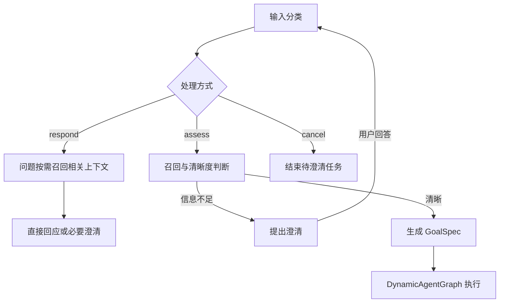

# 输入理解与路由

Karen 在召回、生成 GoalSpec 和执行之前，先通过通用 ModelClient 判断本轮输入类型、与待澄清任务的关系、处理方式。路由提示词独立保存在 `src/karen/intent/prompts.py` 的 `ROUTING_INSTRUCTION`；直接回应使用同文件的 `DIRECT_RESPONSE_INSTRUCTION`。本轮不是新增配置平台或模型注册层。

## 分类与处理

`InputRouting` 是明确的结构化契约：

- `input_types`：information、conversation、question、task_request、task_control，可包含多个类型。
- `task_relation`：new 或 continue。continue 必须存在待澄清任务。
- `handling`：respond、assess、cancel。
- `reason`：简短的判断依据。

分类与处理方式独立。问题可以直接回答，也可能需要外部信息；任务请求必须进一步评估，不能直接声称完成。纯个人信息告知不生成“写入记忆”的业务任务。混合输入保留完整原文，因此“我搬到上海了，查明天天气”既可异步更新事实，也可形成上海天气目标。



现有 LangGraph 承担分类之后的回应、澄清与目标构建分支。分类先于召回执行，避免无关历史元数据决定本轮输入类型；必要历史不可用时仍执行既有澄清保护。

## 会话与取消边界

补充、纠正当前待澄清任务保留 request_id、消息和首次输入的时间基准。无关输入使用新的 request_id、消息列表和时间基准；旧待澄清任务不自动续接，已保存的原文仍可通过记忆关联召回。分类前收到输入的时刻用作新任务的日期基准和原文时间戳，避免分类耗时跨过午夜后改变“明天”。

明确取消待澄清任务不启动执行器，也不生成假的 RunResult。取消并提出新任务时评估新请求，不能因 cancel 分支丢掉新要求。取消订单等外部操作属于业务任务。无待澄清任务时，不能声称已取消工作。

当前文本取消处理的是待澄清任务；正在执行的引擎任务继续通过已有 CancellationToken 控制，终端 Ctrl+C 继续使用既有退出流程。本次不增加执行期间的并发终端输入功能。

## 返回接口与记忆

- `IntentSession.routing` 保存本轮分类；`reply` 保存直接回应或取消确认；`completed` 表示已有 goal 或 reply。
- `TaskTurn.response` 暴露直接回应，`result` 仅用于真实引擎执行。两者均为 None 时读取 `session.questions`。
- `Karen.advance` 分类后选择请求身份、非阻塞提交原文。分类失败也提交原文，原调用方会话保持不变。
- 问题和任务同步召回相关记忆；纯信息告知、寒暄和取消不做无必要的召回。m1/m2/m3 写入仍异步进行。
- 直接回应只确认收到信息，不承诺后台核验、持久化或索引已完成。需要严格写后读时仍可使用 `memory.flush()`。
- 用户界面调用 `record_response` 保存实际显示的直接回复，与执行结果的显示行为一致。
- `--json` 对真实执行返回完整 RunResult；直接回应返回 outcome、answer、routing，不伪造执行状态或 run_id。

GoalSpec.context.execution_instruction 明确规划参考与 inputs/state 的绑定边界，避免把 context.memory 误当成节点可引用的 input 字段；通过现有 GoalSpec 接口对接，不修改执行库。

任务执行状态不代表后台记忆写入状态。记忆摘要提示词明确禁止从 FAILED 或无输出推断“个人事实没有保存”；本次不重写既有历史数据。

分类、直接回应和清晰度判断的模型调用，对于明确标记可重试的连接不可用、超时和限流，最多调用 3 次，分别等待 0.5、1 秒。每次逻辑调用共用原请求的总超时预算，不逐次增加等待上限。认证、额度、权限及结构化输出错误不在此处重试；Ctrl+C 可以中断调用和等待。重试只重发模型请求，不重复提交原文或启动执行器。失败仍保留原调用方会话和异步保存的原文。

未来搬家使用独立的 profile.residence.move_plan 事实，包含目的城市、预计时间精度和计划状态；已经发生的住所使用 profile.residence.city。计划不覆盖当前住所，也不因预计日期到来就自动声称搬家已完成。原文和摘要保留计划的来源与时间。

## 观测与后续调整

观测记录包含 intent.classify、intent.respond/assess、intent.routed，以及输入类型、任务关系、最终路由和理由。分类尚未完成时也能看到输入；最终确认请求身份后按实际 request_id 关联澄清和后台写入。直接回应和取消应没有 execution.started，可观测检查对此作独立验证。

model.retry 记录失败代码、重试次数和等待时间；model.error 与失败 span 记录异常类型链、HTTP 状态码及系统 errno，不保存原始提供方异常消息、请求体或凭据。旧日志无法补回当时未采集的底层错误。

提示词调整先查看误判样本及其上下文，再修改规则和回归用例。这里没有自动学习或写回提示词。

可选的真实模型语义检查：

```bash
uv run --env-file .env python scripts/check_input_routing.py
```

检查使用 `tests/fixtures/input_routing_cases.json` 中的 15 个合成样本，调用当前 DeepSeek 后端并输出实际路由、通过情况及汇总；不读取本地真实记忆、日志或任务文件。不包含 API 调用的普通回归仍使用 `pytest`。
